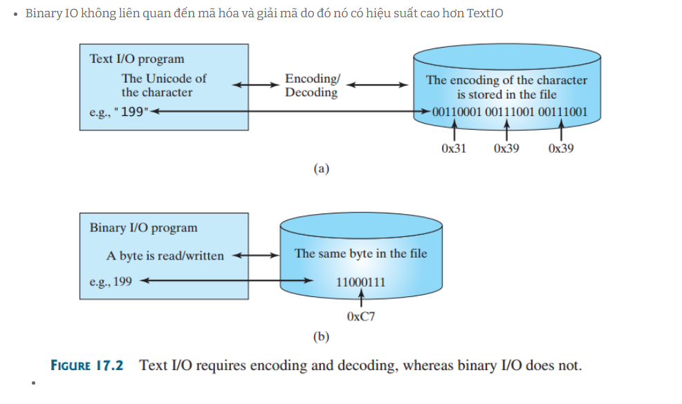
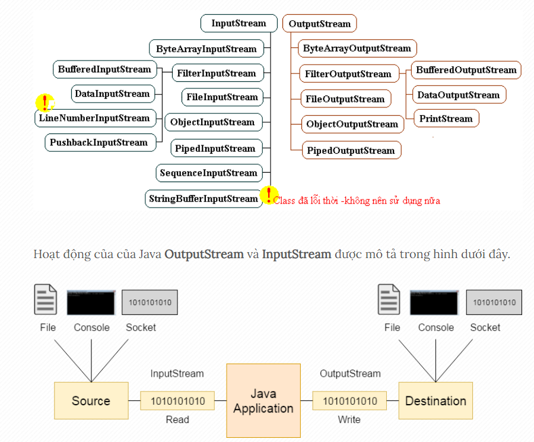
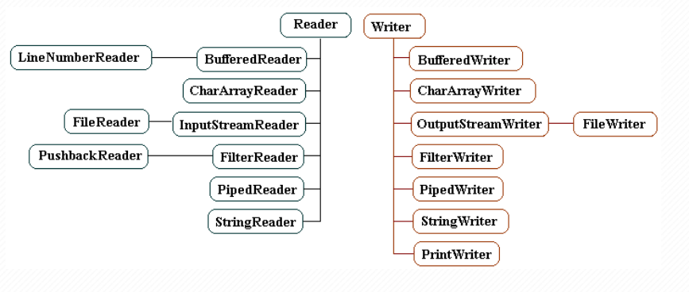

# NHẬP XUẤT FILE, UNIT TEST
## FILE TRONG JAVA
- Trong lập trình Java, có các đối tượng file dùng để thao tác đọc, mở đóng file. Chúng ta có thể lưu trữ giá trị của người dùng vào file. Sau đó chương trình sẽ đọc các file đó và hiển thị cho người dùng.
- Để tạo một đối tượng của File, trước tiên chúng ta cần thêm gói package java.io.File: `File a = new File(String path);`
**NOTE**: Trong Java, tạo một đối tượng tệp không có nghĩa là ta đã tạo ra một tệp. Thay vào đó, một đối tượng tệp là một đại diện trừu tượng của tệp hoặc thư mục đó (với tên tệp được xác định trong dấu ngoặc đơn).

### Các phương thức làm việc với tệp và thư mục

| Thao tác | Phương thức     | Package            |
| -------- | --------------- | ------------------ |
| Tạo file | createNewFile() | java.io.File       |
| Đọc file | read()          | java.io.FileReader |
| Ghi file | write()         | java.io.FileWriter |
| Xóa file | delete()        | java.io.File       |

- **Tạo file**

```Java
import java.io.File;  // Import the File class
import java.io.IOException;  // Import the IOException class to handle errors

public class CreateFile {
  public static void main(String[] args) {
    try {
      File myObj = new File("filename.txt");
      if (myObj.createNewFile()) {
        System.out.println("File created: " + myObj.getName());
      } else {
        System.out.println("File already exists.");
      }
    } catch (IOException e) {
      System.out.println("An error occurred.");
      e.printStackTrace();
    }
  }
}
```

- **Đọc file**

```Java
import java.io.File;  // Import the File class
import java.io.FileNotFoundException;  // Import this class to handle errors
import java.util.Scanner; // Import the Scanner class to read text files

public class ReadFile {
  public static void main(String[] args) {
    try {
      File myObj = new File("filename.txt");
      Scanner myReader = new Scanner(myObj);
      while (myReader.hasNextLine()) {
        String data = myReader.nextLine();
        System.out.println(data);
      }
      myReader.close();
    } catch (FileNotFoundException e) {
      System.out.println("An error occurred.");
      e.printStackTrace();
    }
  }
}
```
- **Ghi file**

```Java
import java.io.FileWriter;   // Import the FileWriter class
import java.io.IOException;  // Import the IOException class to handle errors

public class WriteToFile {
  public static void main(String[] args) {
    try {
      FileWriter myWriter = new FileWriter("filename.txt");
      myWriter.write("Files in Java might be tricky, but it is fun enough!");
      myWriter.close();
      System.out.println("Successfully wrote to the file.");
    } catch (IOException e) {
      System.out.println("An error occurred.");
      e.printStackTrace();
    }
  }
}
```
- **Lấy thông tin của file**

```Java
import java.io.File;  // Import the File class

public class GetFileInfo { 
  public static void main(String[] args) {
    File myObj = new File("filename.txt");
    if (myObj.exists()) {
      System.out.println("File name: " + myObj.getName());
      System.out.println("Absolute path: " + myObj.getAbsolutePath());
      System.out.println("Writeable: " + myObj.canWrite());
      System.out.println("Readable " + myObj.canRead());
      System.out.println("File size in bytes " + myObj.length());
    } else {
      System.out.println("The file does not exist.");
    }
  }
}
```

- **Xóa file**

```Java
import java.io.File;  // Import the File class

public class DeleteFile {
  public static void main(String[] args) { 
    File myObj = new File("filename.txt"); 
    if (myObj.delete()) { 
      System.out.println("Deleted the file: " + myObj.getName());
    } else {
      System.out.println("Failed to delete the file.");
    } 
  } 
}
```

- **Text file**: là file khi mà chúng ta mở ra có thể đọc hiểu được nội dung bên trong
- **Binary file**: là file khi chúng ta mở ra chỉ thấy nội dung đã được mã hóa cho phần nội dung đã ghi vào (thường được sử dụng hơn vì xử lý hiệu quả hơn file text)



### Byte Stream
- Các luồng byte Java được sử dụng để thực hiện input và output của byte 8-bit. Có nhiều lớp liên quan đến các luồng byte nhưng các lớp này được dẫn đầu bởi 2 class `InputStream và OutputStream`:
  - **InputStream:** được sử dụng để đọc dữ liệu từ một nguồn (source).
  - **OutputStream:** được sử dụng để ghi dữ liệu đến đích (destination).



#### Lớp OutputStream
- Lớp OutputStream là một lớp trừu tượng. Nó là super class của tất cả các lớp đại diện cho một output stream của các byte. Một output stream chấp nhận ouput các byte và gửi chúng đến một nơi có thể chứa.

| Phương thức                                                            | Mô tả                                                                                                                                   |
| ---------------------------------------------------------------------- | --------------------------------------------------------------------------------------------------------------------------------------- |
| public void write(int b) throws IOException                            | Được sử dụng để ghi một byte đến output stream hiện tại.                                                                                |
| public void write(byte[] b) throws IOException                         | Được sử dụng để ghi một mảng các byte đến output stream hiện tại.                                                                       |
| public void write(byte[] b, int offset, int length) throws IOException | Được sử dụng để ghi một mảng các byte có độ dài (length) xác định đến output stream hiện tại, bắt đầu từ vị trí (offset) được chỉ định. |
| public void flush() throws IOException                                 | Đẩy các byte được lưu trong vùng đệm của Stream ra thiết bị ngoại vi.                                                                   |
| public void close() throws IOException                                 | Được sử dụng để đóng output stream hiện tại và giải phóng các tài nguyên đang liên kết với Stream                                       |

#### Lớp InputStream
- Lớp InputStream là một lớp trừu tượng. Nó là super class của tất cả các lớp đại diện cho một input stream của các byte.

| Phương thức                                                       | Mô tả                                                                                                                             |
| ----------------------------------------------------------------- | --------------------------------------------------------------------------------------------------------------------------------- |
| public abstract int read() throws IOException                     | Đọc byte kế tiếp của dữ liệu từ input stream. Nó trả về -1 khi đọc đến vị trí cuối tập tin.                                       |
| public abstract int read(byte b[]) throws IOException             | Đọc tất cả các byte hiện có trong Stream vào mảng byte b[].                                                                       |
| public abstract int read(byte b[], int offset, int length) throws | IOException	Đọc số lượng (length) byte  từ Stream hiện tại, lưu vào trong mảng byte (b) bắt đầu từ vị trí (offset) được chỉ định. |
| public int available()throws IOException                          | Trả về số lượng byte hiện có trong Stream.                                                                                        |
| public void close()throws IOException                             | Được sử dụng để đóng input stream hiện tại và giải phóng các tài nguyên đang liên kết với Stream.                                 |

**Tham Khảo:**[ Xử dụng luồng ra vào nhị phân](https://gpcoder.com/3046-huong-dan-su-dung-luong-vao-ra-nhi-phan-trong-java/#Su_dung_FileInputStream_va_FileOutputStream)

### Character Streams
- Luồng ký tự được sử dụng để thực hiện input và output cho unicode 16 bit. Có nhiều lớp liên quan đến các luồng ký tự nhưng các lớp này được dẫn đầu bởi 2 class `Reader và Writer:`
  - **Reader:** được sử dụng để đọc dữ liệu từ một nguồn (source).
  - **Writer:** được sử dụng để ghi dữ liệu đến đích (destination).



## Assertion
- Là một phát biểu mô tả các công việc kiểm tra cần tiến hành, thí dụ: AreEqual(), IsTrue(), IsNotNull()… Mỗi một UT gồm nhiều assertion kiểm tra dữ liệu đầu ra, tính chính xác của các lỗi ngoại lệ ra và các vấn đề phức tạp khác như: – Sự tồn tại của một đối tượng 
- Điều kiện biên: Các giá trị có vượt ra ngoài giới hạn hay không – Thứ tự thực hiện của các luồng dữ liệu …
- Syntax: `assert condition; or assert boolean_expression : error_message;`
### Ưu điểm
-  Nhanh chóng và hiệu quả để phát hiện và sửa lỗi.
- Kiểm tra xác nhận chỉ được thực hiện trong quá trình phát triển và thử nghiệm. Chúng tự động bị xóa trong code release trong thời gian chạy để không làm chậm quá trình thực thi chương trình.
- Nó giúp loại bỏ code viết sẵn và làm cho code dễ đọc hơn.
- Cơ cấu lại và tối ưu hóa mã với độ tin cậy cao hơn rằng nó hoạt động chính xác.

**Tham khảo:**[ Tìm hiểu thêm về assertion](https://cafedev.vn/tu-hoc-java-assertions-trong-java/)
## Unit Test
- `Unit Test` là một loại kiểm thử phần mềm trong đó các đơn vị hay thành phần riêng lẻ của phần mềm được kiểm thử. Kiểm thử đơn vị được thực hiện trong quá trình phát triển ứng dụng. Mục tiêu của Kiểm thử đơn vị là cô lập một phần code và xác minh tính chính xác của đơn vị đó.
- Một Unit là một thành phần PM nhỏ nhất mà ta có thể kiểm tra được như các hàm (Function), thủ tục (Procedure), lớp (Class), hoặc các phương thức (Method).
### Một số khái niệm thường thấy
- `Assertion:` Là một phát biểu mô tả các công việc kiểm tra cần tiến hành, thí dụ: AreEqual(), IsTrue(), IsNotNull()… Mỗi một UT gồm nhiều assertion kiểm tra dữ liệu đầu ra, tính chính xác của các lỗi ngoại lệ ra và các vấn đề phức tạp khác như: – Sự tồn tại của một đối tượng – Điều kiện biên: Các giá trị có vượt ra ngoài giới hạn hay không – Thứ tự thực hiện của các luồng dữ liệu …
- `Test Point:` Là một đơn vị kiểm tra nhỏ nhất, chỉ chứa đơn giản một assertion nhằm khẳng định tính đúng đắn của một chi tiết mã nào đó. Mọi thành viên dự án đều có thể viết một test point. Test Case: Là một tập hợp các test point nhằm kiểm tra một đặc điểm chức năng cụ thể, thí dụ toàn bộ giai đoạn người dùng nhập dữ liệu cho đến khi thông tin được nhập vào cơ sở dữ liệu. Trong nhiều trường hợp kiểm tra đặc biệt và khẩn cấp có thể không cần đến test case.
- `Test Suite:` Là một tập hợp các test case định nghĩa cho từng module hoặc hệ thống con.
- `Regression Testing` (hoặc Automated Testing): Là phương pháp kiểm nghiệm tự động sử dụng một phần mềm đặc biệt. Cùng một loại dữ liệu kiểm tra giống nhau nhưng được tiến hành nhiều lần lặp lại tự động nhằm ngăn chặn các lỗi cũ phát sinh trở lại. Kết hợp Regression Testing với Unit Testing sẽ đảm bảo các đoạn mã mới vẫn đáp ứng yêu cầu thay đổi và các đoạn mã cũ sẽ không bị ảnh hưởng bởi các hoạt động bảo trì.
- `Production Code:` Phần mã chính của ứng dụng được chuyển giao cho khách hàng.
- `Unit Testing Code:` Phần mã phụ để kiểm tra mã ứng dụng chính, không được chuyển giao cho khách hàng.

## Tầm quan trọng của viết Unit Test
- Tạo ra môi trường lý tưởng để kiểm tra bất kỳ đoạn code nào, có khả năng thăm dò và phát hiện lỗi chính xác, duy trì sự ổn định của toàn bộ PM và giúp tiết kiệm thời gian so với công việc gỡ rối truyền thống.
- Phát hiện các thuật toán thực thi không hiệu quả, các thủ tục chạy vượt quá giới hạn thời gian.
- Phát hiện các vấn đề về thiết kế, xử lý hệ thống, thậm chí các mô hình thiết kế.
- Phát hiện các lỗi nghiêm trọng có thể xảy ra trong những tình huống rất hẹp.
- Tạo hàng rào an toàn cho các khối mã: Bất kỳ sự thay đổi nào cũng có thể tác động đến hàng rào này và thông báo những nguy hiểm tiềm tàng.
