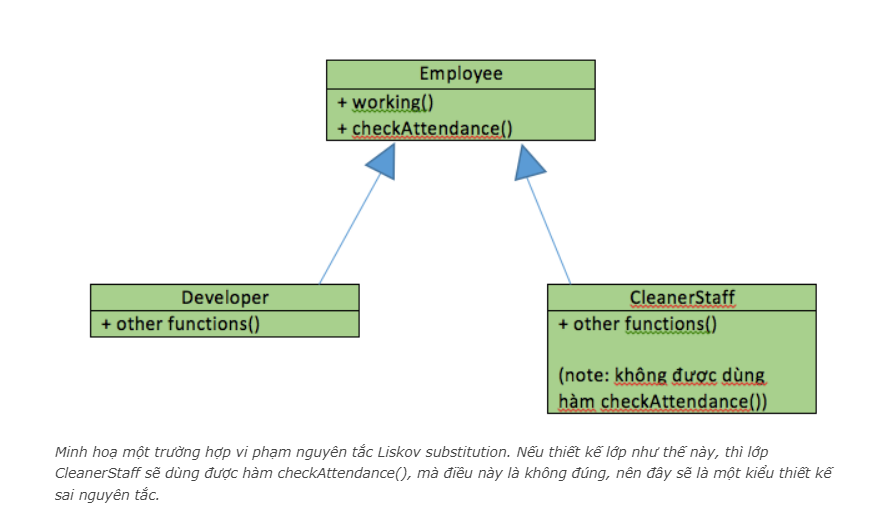
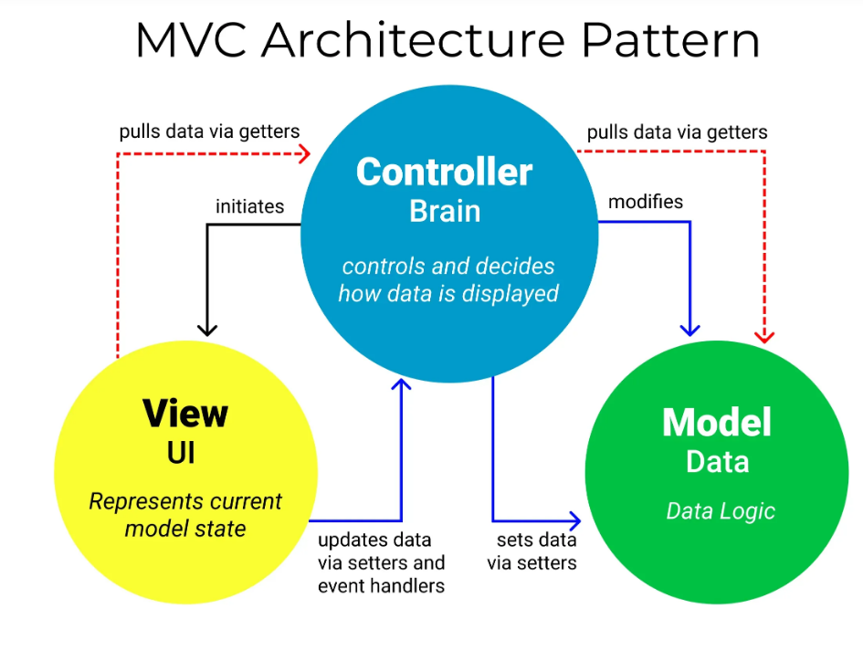
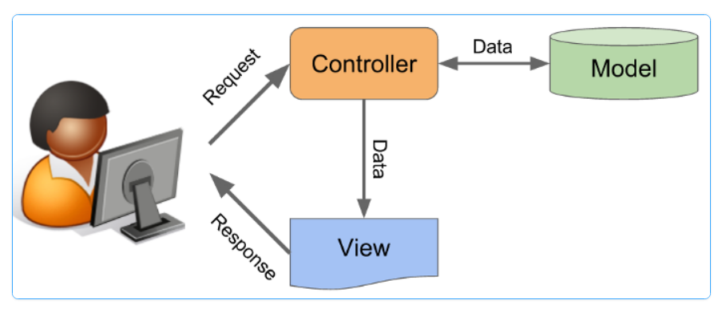

# CÁC NGUYÊN TẮC THIẾT KẾ, MÔ HÌNH THIẾT KẾ
- Hầu hết lập trình viên đều đã biết các tính chất của OOP, nhưng cách thức để phối hợp các tính chất này với nhau để tăng hiệu quả của ứng dụng thì không phải ai cũng nắm được. Một trong những chỉ dẫn để giúp chúng ta sử dụng được OOP hiệu quả hơn đó là nguyên tắc SOLID.

## SOLID là gì?
- `SOLID` là viết tắt của 5 chữ cái đầu trong 5 nguyên tắc thiết kế hướng đối tượng. Giúp cho lập trình viên viết ra những đoạn code dễ đọc, dễ hiểu, dễ maintain. Nó được đưa ra bởi `Robert C. Martin và Michael Feathers`. 5 nguyên tắc đó bao gồm:
  - Single responsibility priciple (SRP)
  - Open/Closed principle (OCP)
  - Liskov substitution principe (LSP)
  - Interface segregation principle (ISP)
  - Dependency inversion principle (DIP)

### Single responsibility priciple
- Một lớp chỉ nên chịu trách nhiệm về một nhiệm vụ cụ thể nào đó.
- Ví dụ: Hình dung rằng nhân viên của một công ty phần mềm cần phải làm 1 trong 3 việc sau đây: lập trình phần mềm (developer), kiểm tra phần mềm (tester), bán phần mềm (salesman). Mỗi nhân viên sẽ có một chức vụ và dựa vào chức vụ sẽ làm công việc tương ứng. Khi đó bạn có nên thiết kế lớp “Employee” với thuộc tính “position” và 3 phương thức developSoftware(), testSoftware() và saleSoftware() không?

```Java
class Employee{
    string position;
    function developSoftware(){};
    function testSoftware(){};
    function saleSoftware(){};
}
```
- Câu trả lời là **Không**. Trong trường hợp thêm một số chức vụ như quản lý.. thì chúng ta phải sửa lại lớp "Employee", thêm các phương thức mới. Nếu có thêm 10 chức vụ nữa thì sao? Khi đó các đối tượng được tạo ra sẽ dư thừa rất nhiều phương thức: Developer thì đâu cần dùng hàm testSoftware() và saleSoftware() đúng không nào, lỡ may dùng lầm phương thức cũng sẽ gây hậu quả khôn lường.
- **Áp dụng nguyên tắc Single Responsibility:** Chúng ta sẽ tạo một lớp trưu tượng "Employee" với phương thức `working()` và mới mỗi chức vụ chúng ta sẽ `implements` lại lớp `Employee` và `Override` lại phương thức `working()` cho phù hợp với từng vị trí.

```Java
public interface Employee {
     void working();
}

public class Developer implements Employee{
    @Override
    public void working(){
        System.out.println("Developing...");
    }
}

public class Tester implements Employee{
    @Override
    public void working(){
        System.out.println("Testing...");
    }
}
```

### Open/Closed principle
- Không được sửa đổi một Class có sẵn, nhưng có thể mở rộng bằng kế thừa.
- Theo nguyên tắc này, sau khi thiết kế một class với một số chức năng nhất định, cần đảm bảo các chức năng này hoạt động trơn tru trong tương lai, tránh sửa đổi thêm sau này. Như vậy, class luôn “đóng – closed” cho các sửa đổi vào các chức năng đã được thiết kế trước, nhưng lại phải “mở – open” để mở rộng tính năng hơn, để mở thì có 1 số cách phổ biến như:
  -  Sử dụng kế thừa
  - Sử dụng interface
  - Sử dụng một số design pattern như Strategy, Decorator, …

```Java
public class People {
    public void getJob(People a){
        if (a instanceof Developer){
            return "Developing...";
        }
        else if (a instanceof Manager){
            return "Managing...";
        }
    }
}

```
- Thay vào đó chúng ta có thể viết

```Java
public class People {
    public void getJob(){
    }
}

class Developer extends People{
    public void getJob(){
        System.out.println("Developing...");
    }
}

```
- Từ đó khi cần thay đổi cho `Developer` thì chúng ta chỉ cần thay đổi ở class con mà không ảnh hướng tới class cha `People`

### Liskov substitution principle
- Các đối tượng (instance) kiểu class con có thể thay thế các đối tượng kiểu class cha mà không gây ra lỗi.



- Quay trở lại ví dụ lớp Emloyee trong phần 1, ta giả sử có công ty sẽ điểm danh vào mỗi buổi sáng, và chỉ có các nhân viên thuộc biên chế chính thức mới được phép điểm danh. Ta bổ sung phương thức checkAttendance() vào lớp Employee.
- Hình dung có một trường hợp sau: công ty thuê một nhân viên lao công để làm vệ sinh văn phòng, mặc dù là một người làm việc cho công ty nhưng do không được cấp số ID nên không được xem là một nhân viên bình thường, mà chỉ là một nhân viên thời vụ, do đó sẽ không được điểm danh.
- **Nguyên tắc này nói rằng:** Nếu chúng ta tạo ra một lớp CleanerStaff kế thừa từ lớp Employee, và implement hàm working() cho lớp này, thì mọi thứ đều ổn, tuy nhiên lớp mới này cũng lại có hàm checkAttendance() để điểm danh, mà như thế là sai quy định dẫn đến chương trình bị lỗi. Như vậy, thiết kế lớp CleanerStaff kế thừa từ lớp Employee là không được phép.

- Có nhiều cách để giải quyết tình huống này ví dụ như tách hàm checkAttendance() ra một interface riêng và chỉ cho các lớp Developer, Tester và Salesman implements interface này.

## KISS, DRY, YAGNI
- **KISS = Keep It Simple, Stupid:** hãy làm cho mọi thứ (mã lệnh của bạn) trở nên đơn giản và dễ nhìn hơn. Hãy chia nhỏ vấn đề và giải quyết từng cái. Hãy để số lượng dòng code của một lớp hay phương thức ở con số hàng chục thôi. Không có nghĩa là viết code ngắn gọn mà là viết code dễ hiểu, dễ bảo trì, dễ mở rộng.
- **DRY = Don’t Repeat Yourself:** đừng có viết lặp bất kỳ lại một đoạn mã nào mà hãy đóng gói nó thành phương thức riêng. Đến khi cần thì chỉ cần gọi tên nó ra. Nguyên tắc này nó giống như tính chất kế thừa trong lập trình hướng đối tượng OOP mà chúng ta đã quá quen thuộc rồi.
- **YAGNI = You Aren’t Gonna Need It:** Hãy viết code dựa trên yêu cầu thực tế. Đừng tự mua thêm việc cho bản thân vào những thứ mà khách hàng không yêu cầu rồi đến lúc nó bug thì ngồi mà khóc =))

## Mô hình MVC
**Tham Khảo: [Mô hình MVC](https://vietnix.vn/tim-hieu-mo-hinh-mvc-la-gi/)**



- **MVC** là viết tắt của cụm từ **“Model-View-Controller“**. Đây là mô hình thiết kế được sử dụng trong kỹ thuật phần mềm. MVC là một mẫu kiến trúc phần mềm để tạo lập giao diện người dùng trên máy tính. MVC chia thành ba phần được kết nối với nhau và mỗi thành phần đều có một `nhiệm vụ riêng` của nó và `độc lập` với các thành phần khác. Tên gọi 3 thành phần:
    - Model (dữ liệu): Quản lí xử lí các dữ liệu.
    - View (giao diện): Nới hiển thị dữ liệu cho người dùng.
    - Controller (bộ điều khiển): Điều khiển sự tương tác của hai thành phần `Model` và `View`.

- **Model:** Là bộ phận có chức năng l`ưu trữ toàn bộ dữ liệu` của ứng dụng và là cầu nối giữa 2 thành phần bên dưới là `View` và `Controller`. Một model là dữ liệu được sử dụng bởi chương trình. Đây có thể là cơ sở dữ liệu, hoặc file XML bình thường hay một đối tượng đơn giản. Chẳng hạn như biểu tượng hay là một nhân vật trong game.
- **View:** Đây là phần giao diện (theme) dành cho người sử dụng. View là phương tiện hiển thị các đối tượng trong một ứng dụng. Chẳng hạn như hiển thị một cửa sổ, nút hay văn bản trong một cửa sổ khác. Nó bao gồm bất cứ thứ gì mà người dùng có thể nhìn thấy được.
- **Controller:** Là bộ phận có nhiệm vụ xử lý các yêu cầu người dùng đưa đến thông qua View. Một controller bao gồm cả Model lẫn View. Nó nhận input và thực hiện các update tương ứng.
- **Ví dụ:** một Controller có thể cập nhật một Model bằng cách thay đổi các thuộc tính của nhân vật trong game. Và nó có thể sửa đổi view bằng cách hiển thị nhân vật được cập nhật trong game đó.

### Luồng xử lý trong MVC
- Luồng xử lý trong của mô hình MVC, bạn có thể hình dung cụ thể và chi tiết qua từng bước dưới đây:
    - Khi một yêu cầu của từ máy khách (Client) gửi đến Server. Thì bị Controller trong MVC chặn lại để xem đó là URL request hay sự kiện.
    - Sau đó, `Controller` xử lý `input` của user rồi giao tiếp với `Model` trong MVC.
    - Model chuẩn bị data và gửi lại cho Controller.
    - Cuối cùng, khi xử lý xong yêu cầu thì Controller gửi dữ liệu trở lại View và hiển thị cho người dùng trên trình duyệt.



