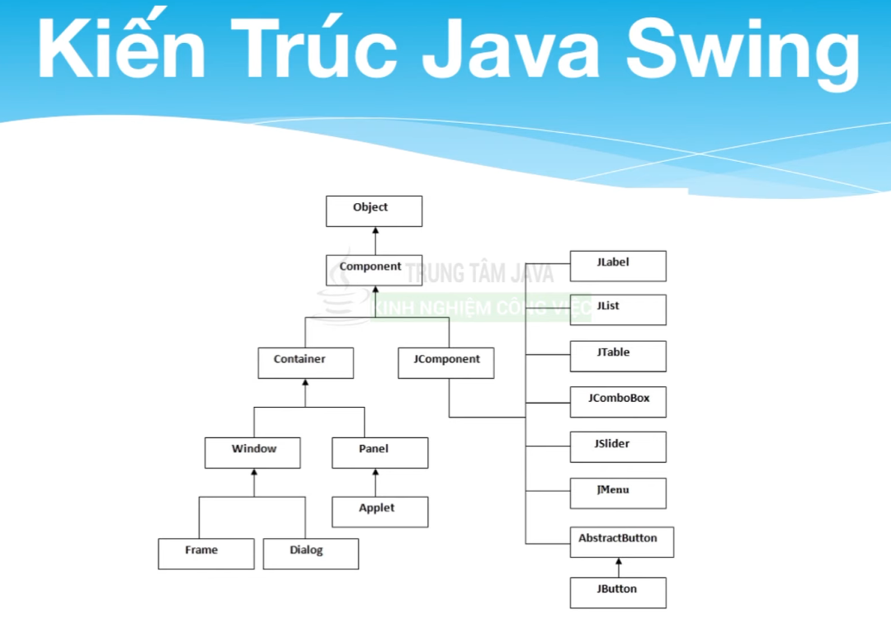
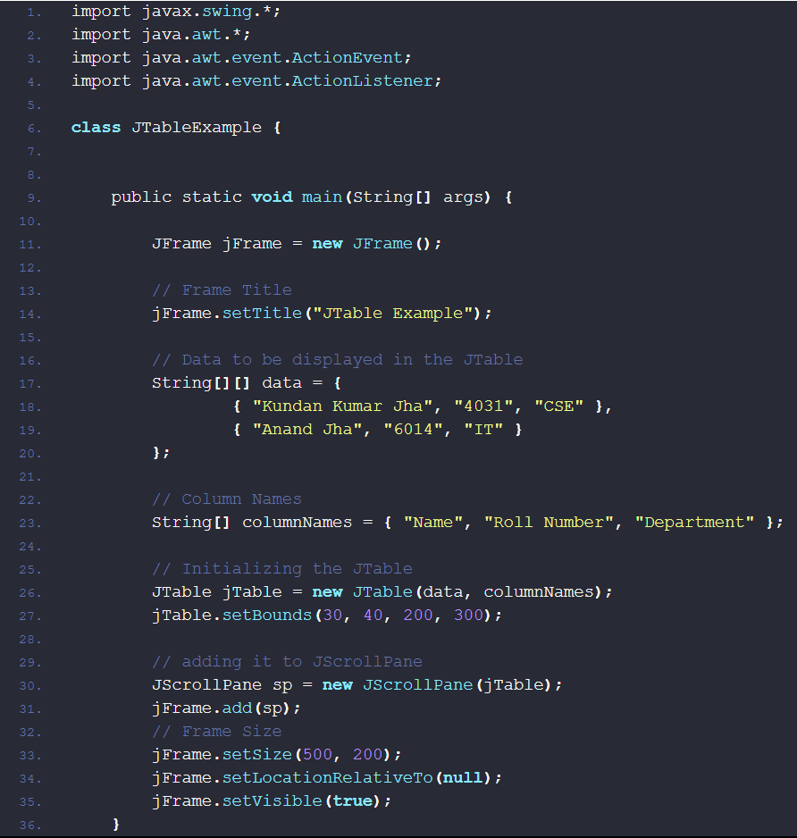

# THƯ VIỆN ĐỒ HOẠ SWING
- Swing trong Java chính là bộ công cụ giao diện người dùng đồ họa (GUI). Swing sẽ cung cấp một bộ widget và gói phong phú, tạo ra các thành phần GUI phù hợp dành cho các ứng dụng Java. Thêm vào đó, nó còn là một phần của JFC (Java Foundation Classes), là API cung cấp GUI để lập trình Java GUI
- Mỗi thành phần trong Swing được gọi là `component`. Component được chia làm 2 loại:
  - Loại khung chứa: là những component định nghĩa khung chứa các component khác bên trong. Các component loại này ko thực hiện chức năng hiển thị nội dung, mà chỉ định nghĩa kích thước, nền, cách sắp xếp và hiển thị các component bên trong. Các component khung chứa thường dùng như JFrame, JPanel, JDialog, …
  - Loại hiển thị: là những component đơn vị thực hiện chức năng hiển thị nội dung. Các component hiển thị thường dùng như JLabel, JButton, JList, JTextField, …
- Các component đều có các phương thức cơ bản sau:
  - `setSize(width, height)` : cài đặt kích thước.
  - `setLocation(x, y)` : cài đặt vị trí (lấy vị trí góc trên bên trái làm gốc).
  - `setBound(x, y, width, height)` : là phương thức ghép chung cả setLocation và setSize.
  - `setBackground(color)` : cài đặt màu nền. Có 2 cách truyền tham số màu: hoặc là dùng màu được quy ước sẵn trong lớp Color, ví dụ như “Color.white”, hoặc tạo một đối tượng Color, ví dụ “new Color(255, 0, 0)”. Có nhiều cách truyền tham số để khởi tạo đối tượng Color, các bạn tham khảo thêm.
  - `setForeground(color)` : cài đặt màu chữ.
  - `setVisible(boolean)` : cài đặt ẩn hay hiện. Thường thì chỉ Frame hay Window bắt buộc phải thiết lập “setVisible(true)”, còn các component khác thì mặc định thiết lập này true rồi.



## JFrame, JButton, JLabel, JTextField, JTable, JList
### JFrame
- Là một Container
- Cung cấp không gian cho các component bên trong hoạt động
- Giống như 1 cửa sổ window có tiêu đề và viền
- Các phương thức:
  - `setTitle("Title")` : cài đặt tên tiêu đề.
  - `setLocationRelativeTo(null)` : đặt cho cửa sổ xuất hiện ở giữa màn hình.
  - `setResizable(false)` : cài đặt ko cho phép kéo thả thay đổi kích thước cửa sổ.
  - `setDefaultCloseOperation(JFrame.DO_NOTHING_ON_CLOSE)` : lựa chọn ko làm gì khi bạn nhấn nút đóng cửa sổ (nút chéo đỏ). Bạn có thể đặt giá trị “EXIT_ON_CLOSE” để thoát chương trình khi nhấn nút đóng, tuy nhiên cách này ko nên dùng vì ko phải lúc nào nó cũng thoát hoàn toàn.
    - `JFrame.DO_NOTHING_ON_CLOSE`– Không làm thêm bất cứ điều gì khi JFrame bị đóng.
    - `JFrame.HIDE_ON_CLOSE` – JFrame sẽ bị ẩn đi khi người dùng đóng nó lại. Chương trình vẫn sẽ hoạt động bình thường trong khi JFrame này bị ẩn. Đây là một hành động mặc định của JFrame.
    - `JFrame.DISPOSE_ON_CLOSE` – Sau khi bị đóng lại, nó đồng thời sẽ bị dọn dẹp rác, các tài nguyên được JFrame này sử dụng sẽ bị thu hồi nhường chỗ cho những nơi khác sử dụng.
    - `JFrame.EXIT_ON_CLOSE` – Sau khi JFrame bị đóng, chương trình cũng sẽ tắt theo.

  - `setLayout(layout)` : cài đặt cách bố trí các component trong container. 
  - `add(component)` : sau khi khởi tạo component thì chúng ta thêm component đó vào container, ví dụ “add(mainPanel)”. Lưu ý phải thêm vào khung chứa thì component đó mới được hiển thị.

### JButton 

```Java
    JButton button = JButton button = new JButton("name");
    buttonbutton.addActionListener(this); // thêm event cho nút và phải implements ActionListener
    button.addActionListener(e -> ....); // không cần implements ActionListener
```
### JLabel

- `setText("Số lần bấm: " + count)` : đặt nội dung text cần hiển thị.
- `setFont(new Font("VNI", Font.PLAIN, 24))` : cài đặt font.
- `setOpaque(true)` : mặc định màu nền của Label là trong suốt, đó là bạn phải cài đặt tính đục bằng true thì phương thức cài đặt màu nền setBackground mới có hiệu lực.
- `setHorizontalAlignment(JLabel.CENTER)` : căn text vào giữa Label theo hàng ngang.
- `setVerticalAlignment(JLabel.CENTER)` : căn text vào giữa Label theo hàng dọc.
Bạn có thể truyền giá trị JLabel.RIGHT để căn sang lề phải.

### JTextField
```Java
public class MyFrame extends JFrame implements ActionListener{
    
    JTextField textField;
    JButton button;

    MyFrame(){
        button = new JButton("Send");
        textField = new JTextField();
        textField.setPreferredSize(new Dimension(250,40));
        
       
//      button.addActionListener(e -> sout("poo")); (ko cần implements AL);
        this.setDefaultCloseOperation(JFrame.EXIT_ON_CLOSE);
        this.setLayout(null);
        this.add(button);
        this.add(textField);
        this.pack();
        this.setVisible(true);
    }
    
    @Override
    public void actionPerformed(ActionEvent e)
    {
        if(e.getSource == button)
        {
            Sysout.out.println("Hello " + textField.getText());
            button.setEnabled(false);
            textField.setEditable(false);
        }
    }
}
```
### JTable
```Java
    JTable table = new JTable(4,2); //4 rows, 2 columns
    table.setValueAt("AloAlo",0,0);
    table.setValueAt("YesSir",1,0);
```



### JList

```Java
JList() – Tạo JList rỗng.
JList(E[] items) – Tạo một JList với các phần tử items được chỉ định trong mảng.
JList(ListModel model) – Tạo một JList với Model được chỉ định sẵn.
JList(Vector items) – Tạo một JList với các phần tử items được chỉ định trong Vector.

Một số hàm thường xuyên sử dụng trong JList:

getSelectedIndex() – Trả về vị trí của phần tử đang được chọn.
getSelectedValue() – Trả về giá trị của phần tử đang được chọn.
setSelectedIndex(int i) – Chọn phần tử tại vị trí i.
setSelectionBackground(Color c) – Thay đổi màu nền của phần tử đang được chọn.
setSelectionForeground(Color c) – Thay đổi màu chữ của phần tử đang được chọn.
setListData(E [ ] l) – Đặt danh sách các phần tử mới trong mảng vào JList, các phần tử đang tồn tại trong Jlist sẽ bị thay thế.
setVisibleRowCount(int v) – Thay đổi visibleRowCount.
setSelectedValue(Object a, boolean s) – Chọn phần tử dựa vào giá trị.
setListData(Vector l) – Đặt danh sách các phần tử mới trong vector vào JList, các phần tử đang tồn tại trong Jlist sẽ bị thay thế.
getSelectedValuesList() – Trả về danh sách các phần tử đang được chọn.
getMinSelectionIndex() – Trả về vị trí nhỏ nhất của phần tử được chọn, -1 nếu không có phần tử nào được chọn.
getMaxSelectionIndex() – Trả về vị trí lớn nhất của phần tử được chọn, -1 nếu không có phần tử nào được chọn.
getLastVisibleIndex() – Trả về vị trí lớn nhất của phần tử trong JList.
```

## BorderLayout, FlowLayout, GridLayout
- **BorderLayout:** BorderLayout sẽ chia cửa sổ thành 5 vùng: North, South, East, West, Center. Mỗi vùng sẽ chứa một thành phần. BorderLayout là layout mặc định của JFrame.
- **FlowLayout** sẽ sắp xếp các thành phần theo chiều ngang, khi không còn chỗ để chứa nữa, nó sẽ chuyển xuống dòng mới. Tưởng tượng như gõ chữ trong văn bản.
- **GridLayout** sẽ chia cửa sổ thành một lưới, mỗi ô sẽ chứa một thành phần. Khi không còn chỗ để chứa nữa, nó sẽ chuyển sang ô tiếp theo.

## Graphics2D, Image
- Để vẽ hình trong Java ta sử dụng `Graphics2D`
- Sử dụng 
 ```Java
class Draw extends JLabel{
    public Draw(){
        setBounds(0, 100, 100, 100);
    }
    public void paintComponent(Graphics g){
        g.setColor(Color.RED);
        g.fillOval(0, 0, 100, 100);
    }
}
```