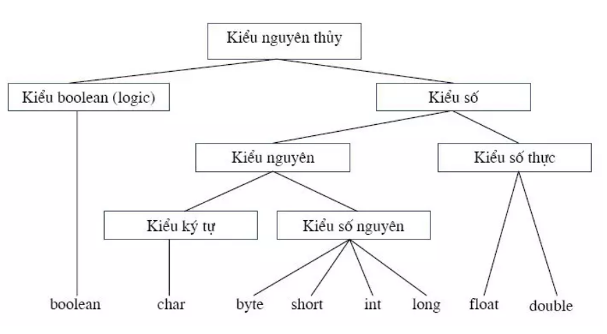

# Danh Mục
- [Danh Mục](#danh-mục)
- [Buổi 3 - Cách Java lưu trữ dữ liệu](#buổi-3---cách-java-lưu-trữ-dữ-liệu)
  - [Cách Java lưu trữ dữ liệu](#cách-java-lưu-trữ-dữ-liệu)
    - [1. Kiểu dữ liệu nguyên thủy.](#1-kiểu-dữ-liệu-nguyên-thủy)
    - [2. Kiểu dữ liệu đối tượng (Object).](#2-kiểu-dữ-liệu-đối-tượng-object)
      - [2.1 Khác nhau giữa kiểu giữ liệu nguyên thủy và kiểu dữ liệu đối tượng.](#21-khác-nhau-giữa-kiểu-giữ-liệu-nguyên-thủy-và-kiểu-dữ-liệu-đối-tượng)
    - [3. Class Object](#3-class-object)
    - [4. Lớp Wrapper, Boxing, Unboxing.](#4-lớp-wrapper-boxing-unboxing)
      - [4.1 Wrapper.](#41-wrapper)
      - [4.2 Boxing.](#42-boxing)
      - [4.3 Unboxing.](#43-unboxing)
  - [Các phương thức khởi tạo trong Java (từ khóa super và this).](#các-phương-thức-khởi-tạo-trong-java-từ-khóa-super-và-this)
    - [1. Từ khóa this.](#1-từ-khóa-this)
      - [1.1 Trong Java từ khóa `this` để tham chiếu đến đối tượng hiện tại.](#11-trong-java-từ-khóa-this-để-tham-chiếu-đến-đối-tượng-hiện-tại)
      - [1.2 `this` còn để dùng gọi `constructor` của lớp hiện tại.](#12-this-còn-để-dùng-gọi-constructor-của-lớp-hiện-tại)
      - [1.3 Gọi phương thức của lớp hiện tại.](#13-gọi-phương-thức-của-lớp-hiện-tại)
      - [1.4 Sử dụng từ khóa `this` như một tham số phương thức.](#14-sử-dụng-từ-khóa-this-như-một-tham-số-phương-thức)
      - [1.5 Sử dụng từ khóa `this` như một tham số của `Constructor`.](#15-sử-dụng-từ-khóa-this-như-một-tham-số-của-constructor)
      - [1.6 Sử dụng từ khóa `this` để trả về instance của lớp hiện tại.](#16-sử-dụng-từ-khóa-this-để-trả-về-instance-của-lớp-hiện-tại)
    - [2. Từ khóa super.](#2-từ-khóa-super)
      - [2.1 Tham chiếu trực tiếp đến biến instance của lớp cha.](#21-tham-chiếu-trực-tiếp-đến-biến-instance-của-lớp-cha)
      - [2.2 `super()` được sử dụng để gọi trực tiếp Constructor của lớp cha.](#22-super-được-sử-dụng-để-gọi-trực-tiếp-constructor-của-lớp-cha)
      - [2.3 `super` được sử dụng để gọi trực tiếp phương thức của lớp cha.](#23-super-được-sử-dụng-để-gọi-trực-tiếp-phương-thức-của-lớp-cha)
  - [Garbage Collector trong Java.](#garbage-collector-trong-java)
    - [1. Garbage collectors là gì?](#1-garbage-collectors-là-gì)
      - [2.1 Làm thế nào có thể một đối tượng không được tham chiếu?](#21-làm-thế-nào-có-thể-một-đối-tượng-không-được-tham-chiếu)
      - [2.2 Phương thức `finalize()`](#22-phương-thức-finalize)
  - [Pass by value (truyền tham trị) trong Java là gì?](#pass-by-value-truyền-tham-trị-trong-java-là-gì)
  - [Pass by reference (truyền tham chiếu)](#pass-by-reference-truyền-tham-chiếu)

# Buổi 3 - Cách Java lưu trữ dữ liệu
## Cách Java lưu trữ dữ liệu
- Khi một chương trình Java được thực thi, nó sẽ yêu cầu hệ điều hành cấp phát một không gian trên bộ nhớ để lưu trữ toàn bộ giữ liệu và thông tin của nó.
- Sau đó, nó sẽ chia vùng không gian đó thành 4 vùng nhớ (**memory segment**): 
- **Vùng nhớ code (code segment):** theo như tên gọi của nó, tất cả mã chương trình được lưu ở đây khi chương trình được thực thi.
- **Vùng nhớ data (data segment):** đây là nơi lưu trữ những dữ liệu chung của chương trình như các biến `static`, `constant`,... những biến dữ liệu mà được sinh ra khi chương trình bắt đầu thực thi và chỉ giải phóng khi chương trình kết thúc.
- **Vùng nhớ stack (stack segment):** đây sẽ là nơi lưu trữ các biến dữ liệu `nguyên thủy (byte, char, short, int, long, float, double và boolean)` và địa chỉ của ô nhớ `memory address`.

    - Gọi là vùng nhớ `stack` bởi vì dữ liệu ở đây chia theo các nhóm gọi là `stack frame (ngăn xếp khung)` và mỗi `stack frame` sẽ được lưu trữ vào vùng nhớ `stack` theo cơ chế `LIFO` như một stack.
    - `stack frame` là nơi lưu chữ toàn bộ biến của một phương thức (method), mỗi phương thức được thực thi sẽ sẽ tạo ra một `stack frame`.
    >Ví dụ ta có 3 method **methodA(), methodB() và main:**
    ```Java
        public static void methodA() {
        int a = 10;
        System.out.println(a);
    }

    public static void methodB() {
        int b = 20;
        System.out.println(b);
        methodA();
    }

    public static void main(String[] args) {
        int c = 30;
        methodB();
    }
    ``` 
    - Khi chương trình được thực thi, nó sẽ tạo ra 3 SF và push vào vùng nhớ stack theo thứ tự nó được gọi: `main, methodB, methodA` 
    - Với phương thức `main()` ta có biến c = 30 nên giá trị 30 này sẽ được lưu trữ ở SF main, và biến c này cũng sẽ có phạm vi sử dụng trong phương thức `main()` mà thôi.

    - Tương tự với các phương thức `methodB()` và `methodA()`, ta  cũng sẽ có các biến b và a tương ứng. Biến b sẽ được lưu trữ ở SF methodB và chỉ có phạm vi sử dụng ở đó, tương tự cho biến a cũng sẽ được lưu trữ ở SF methodA và chỉ có phạm vi sử dụng ở đây thôi nhé.

    - Khi `methodA()` thực thi xong, SF methodA sẽ được pop ra khỏi vùng nhớ stack, biến a (với giá trị là 10) đồng thời cũng được giải phóng. Sau đó SF methodB sẽ được pop, biến b được giải phóng và cuối cùng là tới SF main và biến c.
- **Vùng nhớ heap (heap segment):** là nơi lữu trữ tất cả các đối tượng (object) được sinh ra trong thời gian thực thi chương trình.
>**NOTE**
> - Với vùng nhớ **Code và Data** khi chương trình thực thi sẽ cấp phát một không gian có kích thước không đổi.
> - Vùng nhớ **Stack và Heap** kích thước của nó sẽ thay đổi (*hoặc mở rộng khi tạo thêm biến hay đối tượng hoặc thu hẹp khi một biến hay đối tượng được giải phóng*) và nếu cần mở rộng thì nó sẽ lấy thêm và sẽ lấy ở vùng **Free memory**
> - Ngoài ra, trong bộ nhớ máy tính, mỗi ô nhớ sẽ được đánh địa chỉ để xác định vị trí của nó trong bộ nhớ. Vì vậy trong mỗi ô nhớ sẽ bao gồm 2 thành phần **Value** và **Address**.
### 1. Kiểu dữ liệu nguyên thủy.
- Là kiểu dữ liệu được cung cấp sẵn trong các ngôn ngữ lập trình, nó được dùng để lưu trữ các giá trị đơn giản.
- Kiểu dữ liệu nguyên thủy được lưu vào `vùng nhớ stack.`
### 2. Kiểu dữ liệu đối tượng (Object).

- Kiểu dữ liệu đối tượng được lưu vào vào `vùng nhớ heap.`
- Kiểu dữ liệu đối tượng được chia làm 2 loại:

    - **Framework định nghĩa:** Những đối tượng này được tạo sẵn và công việc của chúng ta chỉ việc gọi lên và sử dụng chúng, ví dụ: `File, String, Scanner...`
    - **Do người dùng định nghĩa:** Chính là những `class` mà chúng ta định nghĩa từ những đối tượng trong bài toán OOP, ví dụ: `Học Sinh, Nhân Viên, Giáo Viên, Lập trình viên...`
>Kiểu dữ liệu **String** là một kiểu dữ liệu **đối tượng** không phải kiểu dữ liệu **nguyên thủy**.
#### 2.1 Khác nhau giữa kiểu giữ liệu nguyên thủy và kiểu dữ liệu đối tượng.
- Kiểu dữ liệu nguyên thủy là kiểu dữ liệu tham trị:
```Java
    int a = 3;
    int b = a;
    b = b + 1;
    System.out.println(a); // 3
    System.out.println(b); // 4
```
- Trong ví trên sẽ thực hiện như sau:

    - Khởi tạo thuộc tính a = 3 khi này hệ thống sẽ cấp phát 1 địa chỉ ô nhớ để lưu trữ giá trị của a và địa chỉ này sẽ có giá trị là 3 
    - Dòng thứ 2 thực hiện phép gán b = a lúc này sẽ khởi tạo ra thuộc tính b và cũng có giá trị là 3 tuy nhiên địa chỉ của a và b là khác nhau 
    - Dòng lệnh thứ 3 sẽ thực hiện tăng b lên 1 đơn vị. Vì a và b đăng ở 2 địa chỉ ô nhớ khác nhau nên giá trị của b thay đổi thì giá trị của a vẫn không bị ảnh hưởng 
    >**Bản chất của tính tham trị là nó chỉ copy giá trị của 1 địa chỉ khác để tạo ra 1 địa chỉ ô nhớ mới có cùng giá trị với địa chỉ vừa copy.**
- Kiểu dữ liệu đối tượng là kiểu dữ liệu có tính tham chiếu:

  - Chúng ta có đối tượng Sinh viên như sau:
    ```Java
    public class Student{
        private String name;
        public SinhVien(String name){
            this.name = name;
        }
        public String getName(){
            return name;
        }
        public void setName(String name){
            this.name = name;
        }
    }
    ```
  - Chúng ta thử tham chiếu với nó
    ```Java
    Student sv1 = new Student("Nguyen Van A");
    Student sv2 = sv1;
    ```
  - Sau đó thay đổi giá trị của sv2
    ```Java
    sv2.setName("Nguyen Van B");
    ```
  - In thử ra sv1 và sv2
    ```Java
    System.out.println("Student 1: " + sv1.getName());
    System.out.println("Student 2: " + sv2.getName());
    ```
  - Kết quả:
   >Student 1: Nguyen Van B
    Student 2: Nguyen Van B

- Nhìn vào `Student sv2 = sv1;` khi này chúng ta cũng tạo ra 1 thuộc tính đối tượng kiểu sv2 tuy nhiên hệ thống sẽ không cấp phát 1 địa chỉ mới để lưu trữ sv2 mà sẽ đưa sv2 trỏ đến địa chỉ của sv1. Tức là sv1 và sv2 sẽ trỏ tới cùng 1 địa chỉ ô nhớ  
- Khi thực hiện `sv2.setName("Nguyen Van B");` sẽ làm giá trị tại địa chỉ ô nhớ thay đổi và tất nhiên sẽ thay đổi cả sv1 và sv2 vì nó cùng trỏ vào 1 địa chỉ ô nhớ.
### 3. Class Object
- Là tổ tiên của mọi lớp trong ngôn ngữ lập trình Java.
- Nếu một lớp không kế thừa từ một lớp nào thì lớp cha trực tiếp của nó là class Object (ngầm định).
- Bạn có thể sử dụng biến của lớp Object để tham chiếu đến mọi đối tượng trong Java.
- Trừ các kiểu dữ liệu nguyên thủy, còn lại đều là đối tượng.
>**Để hiểu rõ hơn: [Lớp Object](https://www.youtube.com/watch?v=RbxW4OOVdCE)**
>**Tham khảo: [Lớp Object](https://yellowcodebooks.com/2017/08/02/java-bai-24-lop-object/)**
### 4. Lớp Wrapper, Boxing, Unboxing.
- Tham khảo: [Lớp Wrapper](https://yellowcodebooks.com/2018/01/19/java-bai-36-lop-wrapper/#Lam_Quen_Voi_Lop_Wrapper)
#### 4.1 Wrapper.
- Lớp Wrapper giúp chúng ta chuyển kiểu dữ liệu nguyên thủy thành kiểu dữ liệu đối tượng và ngược lại.

| **Kiểu nguyên thủy** | **Kiểu Wrapper** |
| -------------------- | ---------------- |
| boolean              | Boolean          |
| char                 | Character        |
| byte                 | Byte             |
| short                | Short            |
| int                  | Integer          |
| long                 | Long             |
| float                | Float            |
| double               | Double           |
#### 4.2 Boxing.
- Chuyển đổi một kiểu dữ liệu nguyên thủy sang kiểu dữ liệu Wrapper gọi là **Boxing**
```Java
    //Các dạng boxing
    int a = 500;
    Integer i = new Integer(a);
    Integer j = new Integer(500);
    Float f = new Float(4.5);
    Double d = new Double(5);
    Character ch = new Character('a');
    Boolean b = new Boolean(true);
```
- Khi gắn biến nguyên thủy trực tiếp vào lớp **Wrapper** người ta gọi là **Autoboxing**
```Java
    //Các dạng autoboxing
    int a = 500;
    Integer i = a;
    Integer j = 500;
    Float f = 4.5f;
    Double d = 5d;
    Character ch = 'a';
    Boolean b = true;
```
#### 4.3 Unboxing.
- Khi chuyển từ kiểu dữ liệu **Wrapper** sang kiểu dữ liệu nguyên thử người ta gọi là **Unboxing**.
- **Unboxing** thông qua phương thức `xxxValue()` với xxx là đại diện cho từng kiểu dữ liệu.
- Các phương thức thức của lớp Wrapper.

    - `parseXxx(""):` Truyền vào phương thức là 1 chuỗi, kết quả nhận được là một giá trị nguyên thủy của chuỗi truyền vào.
    ```Java
        int a = Integer.parseInt ("4");
        System.out.println (a); // 4
    ```
    - `toString()`: Khác với phương thức `toString() của class Object`, truyền vào giá trị nguyên thủy tương ứng với lớp Wrapper đó.
    ```Java
        String a = Integer.toString(10);
        System.out.println (a); // "10"
    ``` 
    - `xxxValue()`: Giúp chuyển đổi một giá trị của lớp Wrapper nào đó về kiểu dữ liệu nguyên thủy (Unboxing).
    ```Java
        Double a = 10.2;
        int i = a.intValue();
        System.out.println (i); // 10
    ```
    - `compareTo()`: So sánh giá trị 2 lớp Wrapper.
    ```Java
        Integer i = 50;
        Integer i1 = Integer.parseInt("50");
        Integer i2 = Integer.valueOf(52);
        Integer i3 = 30;
                
        System.out.println("CompareTo i & i1: " + i.compareTo(i1)); // 0
        System.out.println("CompareTo i & i2: " + i.compareTo(i2)); // -1 
        System.out.println("CompareTo i & i3: " + i.compareTo(i3)); // 1

        //lop1 > lop2 => số dương
        //lop1 < lop2 => số âm
        //lop1 == lop2 => 0
    ```
    - `compare()`:  Phương thức này có công dụng và cách sử dụng giống giống với `compareTo()` trên kia. Khác ở chỗ đây là phương thức static của mỗi lớp Wrapper, nên bạn có thể gọi trực tiếp từ lớp. Đồng thời tham số truyền vào là hai giá trị của hai lớp Wrapper. Kết quả trả về của `compare()` cũng mang một trong ba giá trị `(âm, 0, dương)` như với `compareTo()` trên đây.
    ```Java
        Integer i1 = Integer.parseInt("50");
        Integer i2 = Integer.valueOf(52);
                
        System.out.println("Compare i1 & i2: " + Integer.compare(i1, i2)); // -1
                
        Float f1 = new Float("20.25f");
        Float f2 = new Float("2.43f");
                
        System.out.println("Compare f1 & f2: " + Float.compare(f1,f2)); // 1
    ```
    - `equals()`: tương tự phương thức `equals()` trong so sánh chuỗi. Phương thức này sẽ so sánh giá trị của các lớp Wrapper và trả về `true` và `flase`.
    ```Java
        Integer i1 = Integer.parseInt("50");
        Integer i2 = Integer.valueOf(50);
                
        System.out.println("Compare i1 & i2: " + i1.equals(i2)); //true
                
        Float f1 = new Float("20.25f");
        Float f2 = new Float("2.43f");
                
        System.out.println("Compare f1 & f2: " + f1.equals(f2)); //flase
    ```
## Các phương thức khởi tạo trong Java (từ khóa super và this).
>**Tham khảo: [constructor](https://techmaster.vn/posts/34557/oop-co-ban-phan-3-het-ham-khoi-tao)**
- `Phương thức khỏi tạo` hay còn gọi là `Hàm khởi tạo` cũng có thể gọi là `Constructor`.
**Khai báo constructor:**
```Java
    [khả năng truy cập] <tên_phương_thức> (tham_số_truyền_vào){
        //code
    }
```
- Ngay khi khởi tạo một đối tượng bằng từ khóa `new`, thì `constructor` của đối tượng đó sẽ được gọi đến một cách tự động. Có nghĩa là nếu với phương thức bình thường, bạn phải gọi nó qua toán tử `"."` thì phương thức đó mới được thực thi. Còn với `constructor` thì ngay khi biên dịch đến từ khóa `new` hệ thống sẽ thực thi một `constructor` tương ứng của đối tượng tùy vào `constructor` mà bạn chỉ định.
- `constructor` có tác dụng khỏi tạo. Giúp đối tượng vừa được tạo ra có cơ hội được khởi tạo các giá trị cho các thuộc tính bên trong nó. Hoặc có thể giúp đối tượng đó gọi đến phương thức thức tương ứng nhằm khởi tạo các logic bên trong đối tượng.
- `tên_phương_thức`: cùng tên với tên `class`.
- Các phương thức khởi tạo có thể được nạp chồng, tức là có nhiều phương thức khởi tạo khác nhau trong một lớp, với các tham số khác nhau.
- Các phương thức khởi tạo có thể gọi đến các phương thức khởi tạo khác trong cùng một lớp bằng từ khoá `this`, hoặc gọi đến các phương thức khởi tạo của lớp cha bằng từ khoá `super`.

```Java
    class Circle {
        // Private instance variables
        private double radius;
        private String color;

        // Constructors (overloaded)
        public Circle() {                   // 1st Constructor
            radius = 1.0;
            color = "red";
        }

        public Circle(double r) {           // 2nd Constructor
            radius = r;
            color = "red";
        }

        public Circle(double r, String c) { // 3rd Constructor
            radius = r;
            color = c;
        }

        // Public methods
        public void setRadius(double radius) {
            this.radius = radius;
        }

        public void setColor(String color) {
            this.color = color;
        }

        public double getRadius() {
            return radius;
        }

        public String getColor() {
            return color;
        }

        public double getArea() {
            return radius * radius * Math.PI;
        }
    }

    public class TestCircle {
        public static void main(String[] args) {
            // Test constructors and toString()
            Circle c1 = new Circle(1.1, "blue");
            System.out.println(c1);  // toString()
            Circle c2 = new Circle(2.2);
            System.out.println(c2);  // toString()
            Circle c3 = new Circle();
            System.out.println(c3);  // toString()

            // Test Setters and Getters
            c1.setRadius(2.2);
            c1.setColor("green");
            System.out.println(c1);  // toString() to inspect the modified instance
            System.out.println("The radius is: " + c1.getRadius());
            System.out.println("The color is: " + c1.getColor());
        }
    }
```
### 1. Từ khóa this.
> **Tham khảo: [Từ khóa this](https://viettuts.vn/java/tu-khoa-this-trong-java#goto-h2-4)**
#### 1.1 Trong Java từ khóa `this` để tham chiếu đến đối tượng hiện tại.
```Java
    class Student {

        private String name;
        
        public void setName (String name){
            this.name = name;
        }
    }
```
- Khi có biến trùng tên với thuộc tính của lớp ta dùng con trỏ this để phân biệt được đâu mới là thuộc tính của lớp.
#### 1.2 `this` còn để dùng gọi `constructor` của lớp hiện tại.
- Phương thức `this()` có thể được sử dụng để gọi `Constructor` của lớp hiện tại. Cách sử dụng này sẽ hữu dụng hơn nếu bạn có nhiều `Constructor` trong một lớp và bạn muốn sử dụng lại `Constructor`.

```Java
    public class Student13 {
        int id;
        String name;
    
        public Student13() {
            System.out.println("call Constructor mặc định");
        }
    
        public Student13(int id, String name) {
            this(); // nó được sử dụng để gọi Constructor của lớp hiện tại
            this.id = id;
            this.name = name;
        }
    
        void display() {
            System.out.println(id + " " + name);
        }
    
        public static void main(String args[]) {
            Student13 e1 = new Student13(111, "Viet");
            Student13 e2 = new Student13(222, "Nam");
            e1.display();
            e2.display();
        }
    }
    // call Constructor mặc định
    // call Constructor mặc định
    // 111 Viet
    // 222 Nam
```
- Ví trí sử dụng `this()` để gọi `Constructor`
```Java
    public class Student14 {
        int id;
        String name;
        String city;
    
        public Student14(int id, String name) {
            this.id = id;
            this.name = name;
        }
    
        public Student14(int id, String name, String city) {
            this(id, name);// now no need to initialize id and name
            this.city = city;
        }
    
        void display() {
            System.out.println(id + " " + name + " " + city);
        }
    
        public static void main(String args[]) {
            Student14 e1 = new Student14(111, "Viet");
            Student14 e2 = new Student14(222, "Nam", "Ha Noi");
            e1.display();
            e2.display();
        }
    }

    // 111 Viet null
    // 222 Nam Ha Noi
```
>**Quy tắc: `this()` phải được khai báo dòng lệnh đầu tiên trong Constructor.**
#### 1.3 Gọi phương thức của lớp hiện tại.
- Bạn có thể sử dụng từ khóa `this` để gọi phương thức của lớp hiện tại. Nếu bạn không sử dụng từ khóa `this`, trình biên dịch sẽ tự động thêm từ khóa `this` cho việc gọi phương thức.
```Java
    public class Example3 {
        public void m() {
            System.out.println("Gọi phương thức bằng từ khóa this");
        }
    
        public void n() {
            this.m();
        }
    
        public void p() {
            n();// trình biên dịch sẽ thêm this để gọi phương thức n() như this.n()
        }
    
        public static void main(String args[]) {
            Example3 o1 = new Example3();
            o1.p();
        }
    }
    //Gọi phương thức bằng từ khóa this
```
#### 1.4 Sử dụng từ khóa `this` như một tham số phương thức.
- Từ khóa `this` có thể được dùng như một tham số trong phương thức. Cách dùng này chủ yếu được sử dụng trong xử lý sự kiện.
```Java
    public class Example4 {
        public void m(Example4 obj) {
            System.out.println("Hello Java");
        }
    
        public void p() {
            m(this);
        }
    
        public static void main(String args[]) {
            Example4 o1 = new Example4();
            o1.p();
        }
    }
    //Hello Java
```
- Từ khóa `this` được sử dụng như một tham số trong việc xử lý sự kiện hoặc trong trường hơp mà chúng ta phải cung cấp tham chiếu của một lớp cho một lớp khác.

#### 1.5 Sử dụng từ khóa `this` như một tham số của `Constructor`.
- Bạn cũng có thể truyền từ khóa `this` trong `Constructor`. Tính năng này rất hữu ích nếu chúng ta phải sử dụng một đối tượng trong nhiều lớp.
```Java
    class B {
        A4 obj;
        public B(A4 obj) {
            this.obj = obj;
        }
        public void display() {
            System.out.println(obj.data);// sử dụng biến thành viên cửa lớp A4
        }
    }

    class A4 {
        int data = 10;

        public A4() {
            B b = new B(this);
            b.display();
        }
        public static void main(String args[]) {
            A4 a = new A4();
        }
    }

    //10
```
#### 1.6 Sử dụng từ khóa `this` để trả về instance của lớp hiện tại.
- Chúng ta có thể trả về instance của lớp hiện tại bằng cách sử dụng từ khóa `this`. Trong trường hợp này, kiểu trả về của phương thức phải là kiểu class (không là kiểu nguyên thủy).

```Java
    class A {  
        A getA() {  
            return this;  
        }  
        void msg() {
            System.out.println("Hello Java");
        }  
    }  
    
    class Test1 {  
        public static void main(String args[]) {  
            new A().getA().msg();  
        }  
    }  
    // Hello Java
```
> **Để hiểu rõ hơn: [Từ khóa this](https://www.youtube.com/watch?v=qBO_8rFPIGg&t=96s)**

### 2. Từ khóa super.
- Từ khóa `super` trong Java là một biến tham chiếu được sử dụng để tham chiếu trực tiếp đến đối tượng của lớp cha gần nhất.
- Bất cứ khi nào bạn tạo ra `instance(thể hiển)` của lớp con, một instance của lớp cha được tạo ra ngầm định, nghĩa là được tham chiếu bởi biến `super`.
- Trong java, từ khóa `super` có 3 cách sử dụng như sau:

    - Từ khóa `super` được sử dụng để tham chiếu trực tiếp đến biến instance của lớp cha gần nhất.
    - `super()` được sử dụng để gọi trực tiếp Constructor của lớp cha.
    - Từ khóa `super` được sử dụng để gọi trực tiếp phương thức của lớp cha.
#### 2.1 Tham chiếu trực tiếp đến biến instance của lớp cha.
- Chúng ta biết rằng khi một phương thức xuất hiện trong cả lớp cha và lớp con, phương thức trong lớp con sẽ ghi đè phương thức trong lớp cha.
- Không sử dụng từ khóa `super`
```Java
    class Vehicle {
        int speed = 50;
    }
    
    public class Bike extends Vehicle {
        int speed = 100;
    
        void display() {
            System.out.println(speed); //in speed của lớp Bike   
        }
    
        public static void main(String args[]) {
            Bike b = new Bike();
            b.display();
        }
    }
    // 100
```
- Sử dụng từ khóa `super`
```Java
    class Vehicle {
        int speed = 50;
    }
    
    public class Bike2 extends Vehicle {
        int speed = 100;
    
        void display() {
            System.out.println(super.speed);//in speed của lớp Vehicle  
        }
    
        public static void main(String args[]) {
            Bike2 b = new Bike2();
            b.display();
    
        }
    }
    // 50
```
#### 2.2 `super()` được sử dụng để gọi trực tiếp Constructor của lớp cha.
- Trong java, `super()` được sử dụng để gọi trực tiếp Constructor của lớp cha.

```Java
    class Vehicle {
        public Vehicle() {
            System.out.println("Vehicle is created");
        }
    }
    
    class Bike2 extends Vehicle {
        Bike2() {
            super();//gọi Constructor của lớp cha  
            System.out.println("Bike is created");
        }
    
        public static void main(String args[]) {
            Bike2 b = new Bike2();
        }
    }
    // Vehicle is created
    // Bike is created
```
>**Quy tắc: `super()` phải được khai báo dòng lệnh đầu tiên trong Constructor.**
```Java
    class Vehicle {

        public Vehicle() {
            System.out.println("Vehicle is created");
        }
    }

    class Bike2 extends Vehicle {

        public Bike2() {
            // super();//gọi Constructor của lớp cha  
            System.out.println("Bike is created");
        }

        public static void main(String args[]) {
            Bike2 b = new Bike2();
        }
    }
    // Vehicle is created
    // Bike is created
```
>**Nếu bạn tạo Constructor và bạn không có `this()` hoặc `super()` ở dòng lệnh đầu tiên, trình biên dịch sẽ cung cấp `super()` của Constructor.**

#### 2.3 `super` được sử dụng để gọi trực tiếp phương thức của lớp cha.
- Từ khóa `super` cũng có thể được sử dụng để gọi phương thức của lớp cha. Nó nên được sử dụng trong trường hợp lớp chứa các phương thức tương tự như lớp cha như trong ví dụ dưới đây:
```Java
    class Vehicle {
        public void display() {
            System.out.println("Speed: " + 50);
        }
    }

    class Bike extends Vehicle {

        public void display() {
            System.out.println("Speed: " + 100); //in speed của lớp Bike  
        }
        public static void main(String[] args) {
            Bike b = new Bike();
            b.display();
        }
    }
    // Speed: 100 do sự ghi đè phương thức lớp con lên phương thức của lớp cha
```
- Sử dụng `super` để tránh sự ghi đè phương thức và thực hiện phương thức của lớp cha gần nó nhất.
```Java
    class Vehicle {
        public void display() {
            System.out.println("Speed: " + 50);
        }
    }

    class Bike extends Vehicle {

        public void display() {
            super.display(); //in speed của lớp Vehicle   
            System.out.println("Speed: " + 100); 
        }
        public static void main(String[] args) {
            Bike b = new Bike();
            b.display();
        }
    }
    // Speed: 50 
    // Speed: 100
```
>**Trong trường hợp không có phương thức ở class con giống class cha thì không cần phải sử dụng `super`**
## Garbage Collector trong Java.
>**Tham khảo: [Garbage Collector - codelearn](https://codelearn.io/sharing/garbage-collectors-trong-java)**
>**Tham khảo: [Garbage Collector](https://viettuts.vn/java-thread/garbage-collection-trong-java)**

- Trong Java, `rác (garbage)` có nghĩa là một đối đối tượng không được tham chiếu đến nữa và bộ thu gom rác `(Garbage collector)` có nhiệm vụ hủy các đối tượng đó để giải phóng bộ nhớ.   
### 1. Garbage collectors là gì?
- `Garbage Collectors` (dưới đây sẽ gọi tắt là GC) được định nghĩa như là một quá trình tự động thực thi nhiệm vụ quản lý bộ nhớ. Code Java được dịch sang `bytecode` rồi chạy trên máy ảo Java hay viết tắt là JVM. Trong quá trình chạy chương trình, các đối tượng được tạo ở vùng nhớ `heap`, một phần bộ nhớ dành cho chương trình. Sau cùng, sẽ có một vài đối tượng mà chương trình không cần dùng đến. Các đối tượng này sẽ được `garbage collector` truy tìm và xóa bỏ để thu hồi lại dung lượng bộ nhớ. 
###2. Garbage collectors hoạt động như thế nào?
- Đầu tiên chúng ta hãy nhớ lại kiến trúc JVM, trong module "Run time area" chúng ta có 2 vùng nhớ là vùng nhớ `Stack` (dùng để lưu trữ tham số và các biến local) và vùng nhớ `Heap` (dùng để lưu trữ các đối tượng sau khi khởi tạo bằng từ khóa new và các biến static). Bộ nhớ `Heap` là bộ nhớ cần dọn dẹp nhất vì các Object không cần dùng nữa phải được xóa bỏ để giải phóng bộ nhớ.
- `Garbage collector` là chương trình chạy nền, nó theo dõi toàn bộ các `Object` trong bộ nhớ `(Heap)` và tìm ra những `Object` nào không được dùng nữa `(không có Object nào reference đến nó)`. Toàn bộ những Object không có reference sẽ bị xóa.
- Quá trình thu gôm rác cơ bản thông qua 3 bước:

  - **Marking:** là bước đánh dấu những `Object` còn sử dụng và những `Object` không còn sử dụng.   
  - **Normal deleting:** trình `Garbage Collector` sẽ xóa những `Object` không còn sử dụng.
  - **Deletion with Compacting:** Sau khi những `Object` không còn được sử dụng bị xóa, những `Object` còn được sử dụng sẽ được `"gom"` lại gần nhau. Điều đó làm tăng hiệu xuất sử dụng bộ nhớ trống để cấp phát cho những `Object` mới.

- Ưu điểm:

    - Nó làm cho việc sử dụng bộ nhớ java hiệu quả bởi vì bộ thu gom rác (Garbage Collection) loại bỏ các đối tượng không được tham chiếu từ bộ nhớ heap.
    - Nó được được thực hiện tự động bởi trình thu gom rác (một phần của JVM) vì vậy chúng ta không cần phải nỗ lực nhiều để giải phóng bộ nhớ.

#### 2.1 Làm thế nào có thể một đối tượng không được tham chiếu?
- Bởi gán giá trị null.
```Java
    Employee e = new Employee();
    e = null;
```
- Bởi việc gán đối tượng đến một tham chiếu khác;
```Java
    Employee e1 = new Employee();
    Employee e2 = new Employee();
    e1 = e2;
```
- Bởi một đối tượng annonymous.
```Java
    new Employee(); 
```
#### 2.2 Phương thức `finalize()`
- Phương thức `finalize()` được gọi mỗi lần trước khi đối tượng được thu gom rác. Phương thức này có thể được sử dụng để thực hiện xử lý dọn dẹp. Phương thức này được định nghĩa trong lớp Object như sau:

 ```Java
    protected void finalize(){}
 ```
 >**Garbage Collection của JVM chỉ thu thập các đối tượng được tạo ra bởi từ khoá new. Vì vậy, nếu bạn đã tạo ra bất kỳ đối tượng nào mà không có new, bạn có thể sử dụng phương thức `finalize()` để thực hiện quá trình xử lý dọn dẹp (phá hủy các đối tượng còn lại).**

####2.3 Phương thức gc()
- Phương thức `gc()` được sử dụng để gọi bộ thu gom rác để thực hiện quá trình dọn dẹp. Phương thức `gc()` được cài đặt trong các lớp System và Runtime.

>**Garbage Collection được thực hiện bởi một luồng hiểm gọi là Garbage Collector (GC). Luồng này gọi phương thức `finalize()` trước khi đối tượng thu gom rác.**

**Ví dụ về garbage collection trong java**
```Java
    public class TestGarbage1 {
        public void finalize() {
            System.out.println("object is garbage collected");
        }
    
        public static void main(String args[]) {
            TestGarbage1 s1 = new TestGarbage1();
            TestGarbage1 s2 = new TestGarbage1();
            s1 = null;
            s2 = null;
            System.gc();
        }
    }
    //object is garbage collected
    //object is garbage collected
```
## Pass by value (truyền tham trị) trong Java là gì?
- Nếu chúng ta gọi một phương thức và truyền một giá trị cho phương thức đó được gọi là truyền giá trị. Việc thay đổi giá trị chỉ có hiệu lực trong phương thức được gọi, không có hiệu lực bên ngoài phương thức.
- Khi chúng ta gọi một phương thức và truyền một tham chiếu cho phương thức đó được gọi là truyền tham chiếu. Việc thay đổi giá trị của biến tham chiếu bên trong phương thức làm thay đổi giá trị gốc của nó.
```Java
    public class TuHoc {
        int data = 100;
        public static void change(int data){
            data += 100;
        }
        public static void main(String[] args) {
            TuHoc value1 = new TuHoc();
            System.out.println("Trước khi thay đổi: " + value1.data);
            value1.change(100);
            System.out.println("Sau khi thay đổi: " + value1.data);
        }
    }

    // Trước khi thay đổi: 100
    // Sau khi thay đổi: 100
```
## Pass by reference (truyền tham chiếu)
```Java
    public class TuHoc {
        int data = 100;
        public static void change(TuHoc a){
            a.data += 100;
        }
        public static void main(String[] args) {
            TuHoc value1 = new TuHoc();
            System.out.println("Trước khi thay đổi: " + value1.data);
            value1.change(value1);
            System.out.println("Sau khi thay đổi: " + value1.data);
        }
    }
    // Trước khi thay đổi: 100
    // Sau khi thay đổi: 200
```
---------------------------------------------------------------------------------------------------
