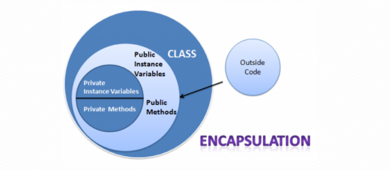
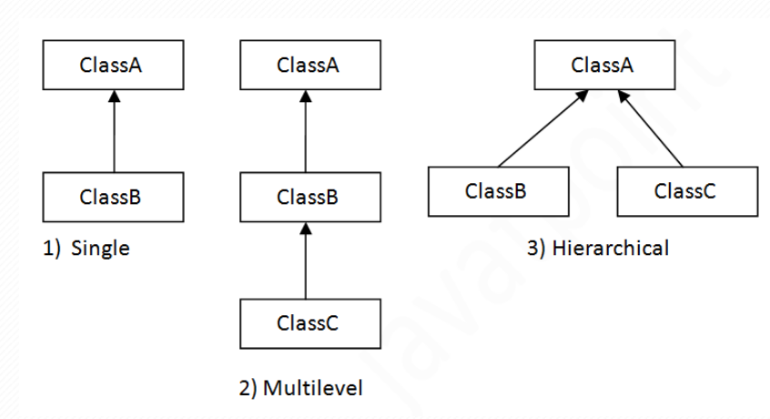

- [Buổi 4 - Mọi thứ đều là hướng đối tượng](#buổi-4---mọi-thứ-đều-là-hướng-đối-tượng)
  - [Tính đóng gói (Encapsulation)](#tính-đóng-gói-encapsulation)
  - [Tính kế thừa (Inheritance)](#tính-kế-thừa-inheritance)
    - [1. Các kiểu kế thừa trong Java](#1-các-kiểu-kế-thừa-trong-java)
      - [1.1 Kế thừa đơn (Single Inheritance)](#11-kế-thừa-đơn-single-inheritance)
      - [1.2 Thừa kế nhiều cấp (Multilevel Inheritance)](#12-thừa-kế-nhiều-cấp-multilevel-inheritance)
      - [1.3 Thừa kế thứ bậc (Hierarchical Inheritance)](#13-thừa-kế-thứ-bậc-hierarchical-inheritance)
      - [2. Tại sao sử dụng tính kế thừa trong Java](#2-tại-sao-sử-dụng-tính-kế-thừa-trong-java)
      - [3. Tại sao đa kế thừa không được support trong java?](#3-tại-sao-đa-kế-thừa-không-được-support-trong-java)
  - [Tính đa hình (Polymorphism)](#tính-đa-hình-polymorphism)
    - [1. Đa hình lúc runtime trong java](#1-đa-hình-lúc-runtime-trong-java)
      - [1.1 Upcasting là gì?](#11-upcasting-là-gì)
      - [1.2 Ví dụ về đa hình tại runtime trong Java](#12-ví-dụ-về-đa-hình-tại-runtime-trong-java)
    - [2. Đa hình tại runtime trong Java với thành viên dữ liệu](#2-đa-hình-tại-runtime-trong-java-với-thành-viên-dữ-liệu)
    - [3. Đa hình lúc runtime trong Java với kế thừa nhiều tầng](#3-đa-hình-lúc-runtime-trong-java-với-kế-thừa-nhiều-tầng)
    - [4. Nạp chồng phương thức (method overloading)](#4-nạp-chồng-phương-thức-method-overloading)
    - [5. Ghi đè phương thức (method overriding)](#5-ghi-đè-phương-thức-method-overriding)
    - [6. Sự khác nhau giữa overloading và overriding trong java](#6-sự-khác-nhau-giữa-overloading-và-overriding-trong-java)

# Buổi 4 - Mọi thứ đều là hướng đối tượng
## Tính đóng gói (Encapsulation)
>**Tham Khảo: [Tính đóng gói](https://gpcoder.com/2365-tinh-dong-goi-encapsulation-trong-java/)**

- Tính đóng gói hay tính bao đóng `(Encapsulation)` là một trong bốn tính chất cơ bản của lập trình hướng đối tượng trong Java.
- Tính đóng gói là kỹ thuật ẩn giấu thông tin không liên quan và hiện thị ra thông liên quan. Mục đích chính của đóng gói trong java là giảm thiểu mức độ phức tạp phát triển phần mềm.


- Tính bao đóng trong Java là một tiến trình đóng gói code và dữ liệu lại với nhau vào trong một đơn vị unit đơn. Chúng ta có thể tạo một lớp được bao đóng hoàn toàn trong Java bằng việc tạo tất cả thành viên dữ liệu của lớp là `private`. Bây giờ, chúng ta sử dụng phương thức setter và getter để thiết lập và lấy dữ liệu trong nó.
- Tính bao đóng là kỹ thuật tạo một trường của lớp `private` và cung cấp khả năng truy cập trường này qua các phương thức pullic. Nếu một trường được khai báo là `private`, nó không thể được truy cập bởi bên ngoài lớp, do đó có thể che dấu các trường có lớp này. Vì lý do này, tính bao đóng được ám chỉ như việc dấu dữ liệu `(data hiding)`.
- **Để đóng gói trong Java chúng ta cần**

    - Khai báo các biến của lớp là **`private`**
    - Cung cấp các phương thức **`getter, getter`** để thay đổi hoặc xem giá trị
    
>**Ví Dụ**

```Java
public class Student {
    private String name;
 
    public String getName() {
        return name;
    }
 
    public void setName(String name) {
        this.name = name;
    }
}
```

- **Lợi ích của đóng gói trong Java**

    - Tất cả các trường (field) của lớp có có chế độ chỉ đọc (read-only) hoặc chỉ ghi (write-only), tức là chỉ có hàm getter hoặc setter.
    - Một lớp có thể có toàn bộ điều khiển thông qua những gì được lưu giữ trong các trường (field) của nó.
    - Người sử dụng của class không biết cách các class lưu trữ dữ liệu. Một class có thể thay đổi kiểu dữ liệu của một trường và người dùng class không cần sự thay đổi trong code.

## Tính kế thừa (Inheritance)
>**Tham khảo: [Tính kế thừa](https://gpcoder.com/2376-tinh-ke-thua-inheritance-trong-java/)**

- Tính kế thừa `(Inheritance)` là một trong bốn tính chất cơ bản của lập trình hướng đối tượng trong Java.
- Kế thừa là sự liên quan giữa hai class với nhau, trong đó có `class cha (superclass)` và `class con (subclass)`. Khi kế thừa class con được hưởng tất cả các phương thức và thuộc tính của class cha. Tuy nhiên, nó chỉ được truy cập các thành viên `public và protected` của class cha. Nó không được phép truy cập đến thành viên private của class cha.
- Tư tưởng của kế thừa trong java là có thể tạo ra một class mới được xây dựng trên các lớp đang tồn tại. Khi kế thừa từ một lớp đang tồn tại bạn có sử dụng lại các phương thức và thuộc tính của lớp cha, đồng thời có thể khai báo thêm các phương thức và thuộc tính khác.
- Từ khóa **`extends`** được sử dụng để kế thừa 1 lớp.

>**Ví dụ**

```Java
public class Employee {
 
    protected float salary = 40000;
 
}
 
public class Programmer extends Employee {
 
    int bonus = 10000;
 
    public static void main(String args[]) {
        Programmer p = new Programmer();
        System.out.println("Programmer salary is:" + p.salary);
        System.out.println("Bonus of Programmer is:" + p.bonus);
    }

}
```
### 1. Các kiểu kế thừa trong Java
- Có 3 kiểu kế thừa trong java: đơn kế thừa `(single)`, kế thừa nhiều cấp `(multilevel)`, kế thừa thứ bậc `(hierarchical)`.
- Khi một class được kế thừa từ nhiều class đươc gọi là đa kế thừa.
- Trong java, một class không được phép thừa kế từ nhiều class, có thể cài đặt `(implement)` nhiều `interface`. Tuy nhiên, một `interface` có thể thừa kế nhiều `interface`.



#### 1.1 Kế thừa đơn (Single Inheritance)
```Java
public class Animal {
    public void eat() {
        System.out.println("eating...");
    }
}
 
public class Dog extends Animal {
    public void bark() {
        System.out.println("barking...");
    }
}
 
public class TestInheritance {
    public static void main(String args[]) {
        Dog d = new Dog();
        d.bark();
        d.eat();
    }
}

//barking...
//eating...
```

#### 1.2 Thừa kế nhiều cấp (Multilevel Inheritance)
```Java
public class Animal {
    public void eat() {
        System.out.println("eating...");
    }
}
 
public class Dog extends Animal {
    public void bark() {
        System.out.println("barking...");
    }
}
 
public class BabyDog extends Dog {
    public void weep() {
        System.out.println("weeping...");
    }
}
 
public class TestInheritance2 {
    public static void main(String args[]) {
        BabyDog d = new BabyDog();
        d.weep();
        d.bark();
        d.eat();
    }
}

// weeping...
// barking...
// eating...
```
#### 1.3 Thừa kế thứ bậc (Hierarchical Inheritance)
```Java
class Animal {
    public void eat() {
        System.out.println("eating...");
    }
}
 
class Dog extends Animal {
    public void bark() {
        System.out.println("barking...");
    }
}
 
public class Cat extends Animal {
    public void meow() {
        System.out.println("meowing...");
    }
}
 
public class TestInheritance3 {
    public static void main(String args[]) {
        Cat c = new Cat();
        c.meow();
        c.eat();
    }
}

// meowing...
// eating...
```
#### 2. Tại sao sử dụng tính kế thừa trong Java
- Để ghi đè phương thức (Method Overriding), do đó có thể thu được tính đa hình tại runtime.
- Để làm tăng tính tái sử dụng của code.
#### 3. Tại sao đa kế thừa không được support trong java?
- Để giảm thiểu sự phức tạp và đơn giản hóa ngôn ngữ, đa kế thừa không được support trong java.
- Hãy suy xét kịch bản sau: Có 3 lớp A, B, C. Trong đó lớp C kế thừa từ các lớp A và B. Nếu các lớp A và B có phương thức giống nhau và bạn gọi nó từ đối tượng của lớp con, như vậy khó có thể xác đinh được việc gọi phương thức của lớp A hay B.

```Java
public class Printable {
    void print() {
        System.out.println("Printable");
    }
}  
  
public class Showable {  
    void print() {
        System.out.println("Showable");
    }
}  
  
// Không thể thực hiện đa thừa kế với class
public class MultiHeritanceExample extends Printable, Showable {  
    public static void main(String args[]) {  
        MultiHeritanceExample obj = new MultiHeritanceExample();  
        obj.print();  // Không thể xác định được gọi phương thức print() của class nào
    }  
}  
```

>**Tham khảo: [Đa kế thừa trong Java](https://viblo.asia/p/da-ke-thua-trong-java-tai-sao-khong-4dbZNJMaZYM)**

## Tính đa hình (Polymorphism)

>**Tham Khảo: [Tính Đa Hình](https://gpcoder.com/2386-tinh-da-hinh-polymorphism-trong-java/)**
- **Tính đa hình** là khả năng một đối tượng có thể thực hiện một tác vụ theo nhiều cách khác nhau.
- Đối với tính chất này, nó được thể hiện rõ nhất qua việc gọi phương thức của đối tượng. Các phương thức hoàn toàn có thể giống nhau, nhưng việc xử lý luồng có thể khác nhau.
- Tính đa hình cung cấp khả năng cho phép người lập trình gọi trước một phương thức của đối tượng, tuy chưa xác định đối tượng có phương thức muốn gọi hay không. Đến khi thực hiện (run-time), chương trình mới xác định được đối tượng và gọi phương thức tương ứng của đối tượng đó.
- Trong Java, chúng ta sử dụng nạp chồng phương thức `(method overloading)` và ghi đè phương thức `(method overriding)` để có tính đa hình.

  - **Nạp chồng (Overloading)**: Đây là khả năng cho phép một lớp có nhiều thuộc tính, phương thức cùng tên nhưng với các tham số khác nhau về loại cũng như về số lượng. Khi được gọi, dựa vào tham số truyền vào, phương thức tương ứng sẽ được thực hiện. 
  - **Ghi đè (Overriding)**: là hai phương thức cùng tên, cùng tham số, cùng kiểu trả về nhưng thằng con viết lại và dùng theo cách của nó, và xuất hiện ở lớp cha và tiếp tục xuất hiện ở lớp con. Khi dùng override, lúc thực thi, nếu lớp Con không có phương thức riêng, phương thức của lớp Cha sẽ được gọi, ngược lại nếu có, phương thức của lớp Con được gọi.

### 1. Đa hình lúc runtime trong java
- Đa hình lúc runtime là quá trình gọi phương thức đã được ghi đè trong thời gian thực thi chương trình. Trong quá trình này, một phương thức được ghi đè được gọi thông qua biến tham chiếu của một lớp cha.

- Trước khi tìm hiểu về đa hình tại runtime, chúng ta cùng tìm hiểu về Upcasting.
#### 1.1 Upcasting là gì?
- Khi biến tham chiếu của lớp cha tham chiếu tới đối tượng của lớp con, thì đó là Upcasting. 
>**Ví Dụ**

```Java
class A {
} 
 
class B extends A {
} 

A a = new B(); //upcasting
```

>**Tham Khảo: [Cơ chế Upcasting và Downcasting trong java](https://gpcoder.com/2406-co-che-upcasting-va-downcasting-trong-java/)**

#### 1.2 Ví dụ về đa hình tại runtime trong Java

>**Ví Dụ 1:** Chúng ta tạo hai lớp Bike và Splendar. Lớp Splendar kế thừa lớp Bike và ghi đè phương thức run() của nó. Chúng ta gọi phương thức run bởi biến tham chiếu của lớp cha. Khi nó tham chiếu tới đối tượng của lớp con và phương thức lớp con ghi đè phương thức của lớp cha, phương thức lớp con được triệu hồi tại runtime.

- Khi việc gọi phương thức được quyết định bởi JVM chứ không phải Compiler, vì thế đó là đa hình tại runtime.

```Java
public class Bike {
    public void run() {
        System.out.println("running");
    }
}
 
public class Splender extends Bike {
    public void run() {
        System.out.println("running safely with 60km");
    }
 
    public static void main(String args[]) {
        Bike b = new Splender(); // upcasting 
        b.run();
    }
}

//running safely with 60km
```

>**Ví dụ 2:** Giả sử Bank là một lớp cung cấp phương thức để lấy lãi suất. Nhưng lãi suất lại khác nhau giữa từng ngân hàng. Ví dụ, các ngân hàng VCB, AGR và CTG có thể cung cấp các lãi suất lần lượt là 8%, 7% và 9%. (Ví dụ này cũng có trong chương ghi đè phương thức nhưng không có Upcasting).

```Java
class Bank {
    int getRateOfInterest() {
        return 0;
    }
}
 
class VCB extends Bank {
    int getRateOfInterest() {
        return 8;
    }
}
 
class AGR extends Bank {
    int getRateOfInterest() {
        return 7;
    }
}
 
class CTG extends Bank {
    int getRateOfInterest() {
        return 9;
    }
}
 
class Test3 {
    public static void main(String args[]) {
        Bank b1 = new VCB(); // upcasting 
        Bank b2 = new AGR(); // upcasting 
        Bank b3 = new CTG(); // upcasting 
        System.out.println("VCB lai suat la: " + b1.getRateOfInterest());
        System.out.println("AGR lai suat la: " + b2.getRateOfInterest());
        System.out.println("CTG lai suat la: " + b3.getRateOfInterest());
    }
}

// VCB lai suat la: 8
// AGR lai suat la: 7
// CTG lai suat la: 9
```

### 2. Đa hình tại runtime trong Java với thành viên dữ liệu
- Đa hình không thể có được với thành viên dữ liệu
> Trong ví dụ sau đây, cả hai lớp có một thành viên dữ liệu là speedlimit, chúng ta truy cập thành viên dữ liệu bởi biến tham chiếu của lớp cha mà tham chiếu tới đối tượng lớp con. Khi chúng ta truy cập thành viên dữ liệu mà không bị ghi đè, thì nó sẽ luôn luôn truy cập thành viên dữ liệu của lớp cha.

>**Qui tắc:** Đa hình tại runtime không thể có được bởi thành viên dữ liệu.

```Java
class Bike {
    int speedlimit = 90;
}
 
class Honda3 extends Bike {
    int speedlimit = 150;
 
    public static void main(String args[]){  
      Bike obj=new Honda3();  
      System.out.println(obj.speedlimit); // 90  
    }
}
```
### 3. Đa hình lúc runtime trong Java với kế thừa nhiều tầng
>**Ví Dụ 1:**
```Java
class Animal {
    void eat() {
        System.out.println("eating");
    }
}
 
class Dog extends Animal {
    void eat() {
        System.out.println("eating fruits");
    }
}
 
class BabyDog extends Dog {
    void eat() {
        System.out.println("drinking milk");
    }
 
    public static void main(String args[]) {
        Animal a1, a2, a3;
        a1 = new Animal();
        a2 = new Dog();
        a3 = new BabyDog();
        a1.eat();
        a2.eat();
        a3.eat();
    }
}

// eating
// eating fruits
// drinking Milk
```

>**Ví Dụ 2:**

```Java
class Animal {
    void eat() {
        System.out.println("animal is eating...");
    }
}
 
class Dog extends Animal {
    void eat() {
        System.out.println("dog is eating...");
    }
}
 
class BabyDog1 extends Dog {
    public static void main(String args[]) {
        Animal a = new BabyDog1();
        a.eat();
    }
}

//Dog is eating (Vì BabyDog1 không ghi đè phương thức eat(), nên phương thức eat() của lớp Dog được gọi.)
```

### 4. Nạp chồng phương thức (method overloading)
- Nếu một lớp có nhiều phương thức cùng tên nhưng khác nhau về kiểu dữ liệu hoặc số lượng các tham số, thì đó là nạp chồng phương thức `(Method Overloading).`

- Nạp chồng phương thức được sử dụng để thu được tính đa hình lúc biên dịch **`(compile).`**
- Có 2 cách nạp chồng phương thức trong java

    - Thay đổi số lượng các tham số
    - Thay đổi kiểu dữ liệu của các tham số
> ***Tại sao không thể nạp chồng phương thức bằng cách chỉ thay đổi kiểu trả về của phương thức?***
> *Trong java, không thể nạp chồng phương thức bằng cách chỉ thay đổi kiểu trả về của phương thức bởi vì không biết phương thức nào sẽ được gọi.*
### 5. Ghi đè phương thức (method overriding)
- `Ghi đè phương thức` trong java xảy ra nếu lớp con có phương thức giống lớp cha.
- Ghi đè phương thức được sử dụng để thu được tính đa hình tại **`runtime.`**
- Nguyên tắc ghi đè phương thức:

   - Phương thức phải có tên giống với lớp cha.
   - Phương thức phải có tham số giống với lớp cha.
   - Lớp con và lớp cha có mối quan hệ kế thừa.

> ***Có ghi đè được phương thức static không?***
> *Không, phương thức static không thể ghi đè được, bởi vì ghi đè phương thức được thực thi lúc runtime (tính đa hình).*

>***Tại sao không ghi đè được phương thức static?*** 
*Vì phương thức static được ràng buộc với class, còn phương thức instance được ràng buộc với đối tượng. Static thuộc về vùng nhớ class còn instance thuộc về vùng nhớ heap.*

>***Có ghi đè phương thức main được không?***
*Không, vì main là phương thức static.*

### 6. Sự khác nhau giữa overloading và overriding trong java

| Nạp chồng phương thức                                                       | Ghi đè phương thức                                                                                                         |
| --------------------------------------------------------------------------- | -------------------------------------------------------------------------------------------------------------------------- |
| Nạp chồng phương thức được sử dụng để tăng tính có thể đọc của chương trình | Ghi đè phương thức được sử dụng để cung cấp trình triển khai cụ thể của phương thức mà đã được cung cấp bởi lớp cha của nó |
| Nạp chồng phương thức được thực hiện bên trong lớp (class)                  | Ghi đè phương thức xuất hiện trong hai lớp mà có mối quan hệ IS-A (kế thừa)                                                |
| Trong Nạp chồng phương thức, tham số phải khác nhau                         | Trong Ghi đè phương thức, tham số phải là giống nhau                                                                       |
| Nạp chồng phương thức là ví dụ của đa hình tại biên dịch (compile)          | Ghi đè phương thức là ví dụ của đa hình tại thực thi (runtime)                                                             |
