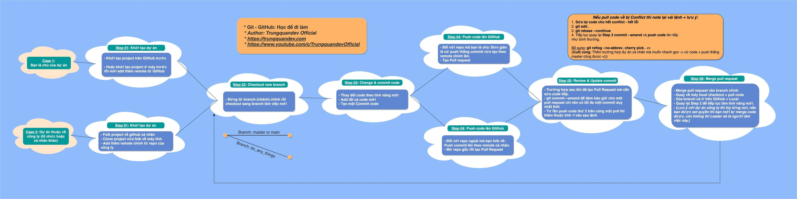
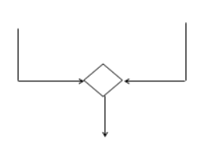

- [DEV THÌ KHÔNG CHỈ VIẾT CODE](#dev-thì-không-chỉ-viết-code)
  - [1. Version Control là gì? Tại sao lại phải sử dụng Version Control](#1-version-control-là-gì-tại-sao-lại-phải-sử-dụng-version-control)
  - [2. Các khái niệm về Git: Local Repository, Remote Repository, Branch, Commit, Merge, Pull, Push, Clone, Fork.](#2-các-khái-niệm-về-git-local-repository-remote-repository-branch-commit-merge-pull-push-clone-fork)
    - [2.1. Repository](#21-repository)
      - [2.1.1. Local Repository](#211-local-repository)
      - [2.1.2. Remote Repository](#212-remote-repository)
    - [2.2. Branch](#22-branch)
    - [2.3. Commit](#23-commit)
    - [2.4. Merge](#24-merge)
    - [2.5. Pull](#25-pull)
    - [2.6. Push](#26-push)
    - [2.7. Clone](#27-clone)
    - [2.8. Fork](#28-fork)
  - [3. Khi nào cần Pull Request? Cách tạo Pull Request](#3-khi-nào-cần-pull-request-cách-tạo-pull-request)
  - [4. UML là gì? Lí do cần vẽ UML](#4-uml-là-gì-lí-do-cần-vẽ-uml)
  - [5. Mô hình Class Diagram, Activity Diagram](#5-mô-hình-class-diagram-activity-diagram)
    - [5.1 Class Diagram](#51-class-diagram)
    - [5.2. Activity Diagram](#52-activity-diagram)

# DEV THÌ KHÔNG CHỈ VIẾT CODE
## 1. Version Control là gì? Tại sao lại phải sử dụng Version Control
- **`Version Control System (VCS)`** là hệ thống kiểm soát phiên bản, giúp theo dõi và quản lý các thay đổi đối với hệ thống tập tin.
  - Nó hỗ trợ người dùng chia sẻ và báo cáo thông tin về những thay đổi trên file hoặc thư mục.
  - Nó giúp quản lý các hành động thêm, sửa và xóa các tệp và thư mục.

Một số Version control phổ biến bao gồm **Git, Mercurial, và SVN**. **Git** là một trong những VCS phổ biến nhất, được sử dụng rộng rãi trong cộng đồng phát triển phần mềm.

- Lý do sử dụng VCS:
  - Lưu lại lịch sử các version của bất kỳ thay đổi nào của dự án. Giúp xem lại các sự thay đổi hoặc khôi phục `(revert)` lại sau này.
  - Việc chia sẻ code trở nên dễ dàng hơn, lập trình viên có thể để public cho bất kỳ ai, hoặc private chỉ cho một số người có thẩm quyền có thể truy cập và lấy code về.

## 2. Các khái niệm về Git: Local Repository, Remote Repository, Branch, Commit, Merge, Pull, Push, Clone, Fork.

> **Tham Khảo: [GIT](https://topdev.vn/blog/git-la-gi/#_git-la-gi-5)**

> **Thao Khảo: [Git - GitHub • Học Git thực tế để đi làm](https://www.youtube.com/watch?v=swlrBlriFPE)**

- `Git` là một hệ thống quản lý phiên bản phân tán `(Distributed Version Control System – DVCS)`, nó là một trong những hệ thống quản lý phiên bản phân tán phổ biến nhất hiện nay. Git cung cấp cho mỗi lập trình viên kho lưu trữ `(repository)` riêng chứa toàn bộ lịch sử thay đổi.

**Khác biệt giữa Git và các VCS khác**

-  Hầu hết các hệ thống khác đều lưu trữ thông tin dưới dạng danh sách các thay đổi dựa trên file.

- Git không nghĩ đến hoặc lưu trữ dữ liệu của mình theo cách này. Thay vào đó, Git coi thông tin được lưu trữ là một tập hợp các `snapshot` – ảnh chụp toàn bộ nội dung tất cả các file tại thời điểm.
- Mỗi khi bạn **`commit`**, Git sẽ **`chụp`** và tạo ra một `snapshot` cùng một tham chiếu tới `snapshot` đó. Để hiệu quả, nếu các tệp không thay đổi, Git sẽ không lưu trữ lại file - chỉ là một liên kết đến tệp giống file trước đó mà nó đã lưu trữ. Git nghĩ về dữ liệu của nó giống như dưới đây:

>Đây là điểm khác biệt quan trọng giữa Git và gần như tất cả các VCS khác. Nó khiến Git phải xem xét lại hầu hết mọi khía cạnh của kiểm soát phiên bản mà hầu hết các hệ thống khác đã sao chép từ thế hệ trước. Điều này làm cho Git giống như một hệ thống tệp nhỏ với một số công cụ cực kỳ mạnh mẽ được xây dựng trên nó, thay vì chỉ đơn giản là một VCS.

**Lợi ích của Git**

- Dễ sử dụng, thao tác nhanh, gọn, lẹ và rất an toàn.
- Dễ dàng kết hợp các phân nhánh `(branch)`, có thể giúp quy trình làm việc code theo nhóm đơn giản hơn rất nhiều.
- Chỉ cần clone mã nguồn từ kho chứa hoặc clone một phiên bản thay đổi nào đó từ kho chứa, hoặc một nhánh nào đó từ kho chứa là bạn có thể làm việc ở mọi lúc mọi nơi.
- Deployment sản phẩm của bạn một cách không thể nào dễ dàng hơn.

### 2.1. Repository
Là nơi lưu trữ tất cả những thông tin cần thiết để duy trì và quản lý các sửa đổi và lịch sử của dự án (nơi trữ source code và các thay đổi trên đống source code này)
#### 2.1.1. Local Repository

- Là `repository` nằm trên chính máy tính của chúng ta, `repository` này sẽ đồng bộ hóa với `remote repository` bằng các lệnh của git.

#### 2.1.2. Remote Repository

- Là `repository` được cài đặt trên server chuyên dụng. Ví dụ: `GitHub, GitLab, Bitbucket,...`

- Khi tự khởi tạo một `repository`, chúng ta gõ lệnh `$ git init`, lệnh này sẽ tạo ra một thư mục `.git` và đây chính là repository còn phần code nằm cùng với thư mục `.git` được gọi là `Working Directory`
- Sau khi gõ lệnh git init, nếu nhận được thông báo như sau thì việc thực hiện tạo repository đã thành công: `Initialized empty Git repository in path_to_folder/.git/`

### 2.2. Branch

- Các `Branch (nhánh)` đại diện cho các phiên bản cụ thể của một kho lưu trữ tách ra từ project chính của bạn.
- Branch cho phép bạn theo dõi các thay đổi thử nghiệm bạn thực hiện đối với kho lưu trữ và có thể hoàn nguyên về các phiên bản cũ hơn.
- Branch trong Git được chia làm 2 loại, là `branch master (nhánh chính)` và các branch khác do bạn tạo ra trong quá trình làm việc. 
- **Branch master:** Là nhánh đầu tiên khi khởi tạo một Git repository, branch master thường là nơi chứa source code đang chạy ổn định. 
- **Các loại branch:**
    - ***Branch local:*** là branch lưu ở local (tất nhiên rồi). Nó có thể được liên kết với 1 branch ở remote hoặc không. Hiển thị branch có trên local ta dùng lệnh `git branch`.
    - ***Branch remote:*** là branch lưu ở remote. Branch này có thể `fetch` về local nhưng không tạo thêm branch ở local. Hiểu đơn giản là bạn có thể tải branch ở remote về nhưng không tạo 1 branch ở local với tên tương tự và tất nhiên sẽ không liên kết nó với một branch local nào cả. Để hiển thị branch remote có trên local dùng lệnh `git branch -r`

**Tạo branch**: `git branch <branchname>`
**Xoá một branch ở phía local:** `git branch -D <branch_name>`
**Xoá một branch ở phía remote:**`git push <remote_name> --delete <branch_name>`
**Xoá một branch ở phía remote:**`git push <remote_name> --delete <branch_name>`
**Chuyển nhánh:**`git checkout <branch>` hoặc `git checkout -b <branch name>`(Chuyển nhánh và tạo nhánh `branch name`)

### 2.3. Commit

- Lệnh `git commit` trong Git được sử dụng để lưu lại những thay đổi bạn đã thực hiện trong kho lưu trữ (repository). Sau khi bạn đã thực hiện các sửa đổi trong mã nguồn của mình, bạn sẽ muốn "commit" những thay đổi đó để tạo ra một điểm kiểm soát trong lịch sử của dự án.

- `git commit -m "message"` or `git commit --amend :wq` (những thay đổi sẽ đc gộp vào commit ngay trước đó)

### 2.4. Merge

- Lệnh `git merge` trong Git được sử dụng để kết hợp các thay đổi từ một nhánh vào nhánh hiện tại. Quá trình này thường được sử dụng để tích hợp các thay đổi từ một nhánh phụ (thường là một tính năng hoặc một nhánh sửa lỗi) vào nhánh chính.

- Trước khi merge ta phải checkout sang nhánh chính và sử dụng `git merge <branch-name>` hoặc `git merge <branch-name> <merged-branch-name>`

### 2.5. Pull
- Lệnh `git pull` trong Git được sử dụng để cập nhật mã nguồn từ một kho lưu trữ từ xa (remote repository) và tự động thực hiện lệnh git merge để kết hợp các thay đổi vào nhánh hiện tại.

- `git pull <remote> <branch>`

**Trong đó:**

  - `<remote>` là tên của kho lưu trữ từ xa, thường là "origin" nếu bạn đã clone một dự án.
  - `<branch>` là tên của nhánh từ xa bạn muốn cập nhật và kết hợp.

### 2.6. Push

- Lệnh `git push` trong Git được sử dụng để đẩy các commit từ máy của bạn lên một kho lưu trữ từ xa (remote repository), cập nhật các nhánh từ xa và chia sẻ công việc của bạn với người khác.

- `git push <remote> <branch>` or `git push <remote> <branch> -f` (fork update lên pull request đã tạo)

**Trong đó:**
  - `<remote>` là tên của kho lưu trữ từ xa, thường là "origin" nếu bạn đã clone một dự án.
  - `<branch>` là tên của nhánh cục bộ bạn muốn đẩy lên kho lưu trữ từ xa.

### 2.7. Clone

- Lệnh `git clone` trong Git được sử dụng để sao chép (clone) một kho lưu trữ từ xa (remote repository) vào máy tính của bạn. Quá trình này tạo ra một bản sao đầy đủ của kho lưu trữ đó, bao gồm tất cả lịch sử commit, nhánh, và tất cả các tệp tin cần thiết để bạn có thể bắt đầu làm việc trên dự án đó.

- `git clone <url_kho_luu_tru>`

### 2.8. Fork

- Là hành động tạo một bản sao của repository gốc thành một repository của bạn. Việc fork một repository cho phép bạn dễ dàng chỉnh sửa, thay đổi source code mà không ảnh hưởng tới source gốc.

- Khác vói `clone`, `fork` tạo bảo sao về kho lưu trữ của bạn còn `clone` sẽ tạo bảo sao về `local`

## 3. Khi nào cần Pull Request? Cách tạo Pull Request

- Pull Request là một khái niệm chủ yếu được sử dụng trong các dự án quản lý mã nguồn mở và các hệ thống quản lý mã nguồn phân tán như GitHub, GitLab, và Bitbucket. Mục tiêu của Pull Request là mở ra một diễn đàn để thảo luận về và kiểm tra các thay đổi trước khi chúng được tích hợp vào nhánh chính của dự án.

- Chúng ta tạo Pull Request trước khi muốn `merge` một `branch` nào đó vào `branch` chính để cho mọi người có thể review thay đổi.

- Một số tình huống cần **`pull request:`**

  - **Đóng Góp vào Dự Án Mã Nguồn Mở:** Khi bạn muốn đóng góp vào một dự án mã nguồn mở, bạn tạo một fork của dự án đó, thực hiện các thay đổi trong fork của mình, và sau đó tạo một Pull Request để yêu cầu nhà quản lý dự án tích hợp thay đổi của bạn.
  - **Kiểm Tra và Phê Duyệt Thay Đổi:** Trong môi trường làm việc nhóm, Pull Request cung cấp một cách để thành viên nhóm kiểm tra và phê duyệt thay đổi của người khác trước khi chúng được kết hợp vào nhánh chính.
  - **Quản Lý Quy Trình Phát Triển:** Trong các quy trình phát triển như Gitflow, Pull Request được sử dụng để tích hợp các tính năng hoặc sửa lỗi từ nhánh phụ vào nhánh chính.

- Cách tạo Pull Request:

  - **Fork Dự Án:** sao chép dự án mà bạn muốn đóng góp về repo của mình.
  - **Clone fork về máy:** sử dụng `git clone`
  - **Tạo nhánh và thực hiện thay đổi:** Tạo một nhánh mới `(git checkout -b feature-branch)` và thực hiện các thay đổi trong nhánh đó.
  - **Commit và Push Thay Đổi:** Commit các thay đổi `(git commit -m "Your message")` và đẩy chúng lên nhánh của bạn trên fork `(git push origin feature-branch).` tuyệt đối không push thẳng lên repo gốc.
  - **Tạo Pull Request:** Sang repo chính chọn  sau đó 
  - **Thảo Luận và Phê Duyệt:** Thành viên nhóm hoặc nhà quản lý dự án sẽ kiểm tra Pull Request, thảo luận và thực hiện các thay đổi (nếu cần).
    - Khi thay đổi được chấp nhận, nó sẽ được `merge` vào nhánh chính.

>**Trong dự án cá nhân muốn nhanh gọn cứ code + push thẳng cũng được :P**

## 4. UML là gì? Lí do cần vẽ UML
- **UML** (Unified Modeling Language - ngôn ngữ mô hình hóa thống nhất) là một ngôn ngữ mô hình gồm các ký hiệu đồ họa mà các phương pháp hướng đối tượng sử dụng để thiết kế các hệ thống thông tin một cách nhanh chóng.
- **UML** sử dụng một hệ thống ký hiệu thống nhất biểu diễn các Phần tử mô hình `(model elements)`. Tập hợp các phần tử mô hình tạo thành các Sơ đồ `UML (UML diagrams)`. Có các loại sơ đồ UML chủ yếu sau:

  - *Sơ đồ lớp (Class Diagram)*
  - *Sơ đồ đối tượng (Object Diagram)*
  - *Sơ đồ tình huống sử dụng (Use Cases Diagram)*
  - *Sơ đồ trình tự (Sequence Diagram)*
  - *Sơ đồ cộng tác (Collaboration Diagram hay là Composite Structure Diagram)*
  - *Sơ đồ trạng thái (State Machine Diagram)*
  - *Sơ đồ thành phần (Component Diagram)*
  - *Sơ đồ hoạt động (Activity Diagram)*
  - *Sơ đồ triển khai (Deployment Diagram)*
  - *Sơ đồ gói (Package Diagram)*
  - *Sơ đồ liên lạc (Communication Diagram)*
  - *Sơ đồ tương tác (Interaction Overview Diagram - UML 2.0)*
  - *Sơ đồ phối hợp thời gian (Timing Diagram - UML 2.0)*

- **Lý do cần vẽ UML:**
  - *Hiểu rõ Yêu Cầu:* UML giúp mô tả và hiểu rõ các yêu cầu của hệ thống từ góc độ người quản lý dự án và người sử dụng.
  - *Thiết Kế Hệ Thống:* UML cung cấp các biểu đồ và ký hiệu để thiết kế cấu trúc và cách thức hoạt động của hệ thống.
  - *Giao Tiếp Hiệu Quả:* UML tạo ra một ngôn ngữ chung để mô tả ý tưởng và thiết kế, giúp tăng cường giao tiếp giữa các thành viên trong nhóm phát triển và giữa nhóm phát triển và người quản lý.
  - *Tạo Ra Tài Liệu Hệ Thống:* UML giúp tạo ra tài liệu dự án đồng thời và thực hiện, giúp dễ dàng theo dõi và duy trì hệ thống.
  - *Kiểm Tra và Đánh Giá Thiết Kế:* Các biểu đồ UML, như biểu đồ lớp, biểu đồ tuần tự, và biểu đồ use case, có thể được sử dụng để kiểm tra và đánh giá thiết kế của hệ thống trước khi bắt đầu quá trình phát triển.
  - *Quản Lý Các Yếu Tố Phức Tạp:* UML giúp quản lý sự phức tạp của hệ thống bằng cách tạo ra các mô hình trừu tượng để giảm bớt sự phức tạp và tăng tính rõ ràng.
  - *Phân Chia Công Việc:* UML có thể được sử dụng để phân chia công việc giữa các thành viên trong nhóm phát triển và làm cho mỗi người hiểu rõ vai trò và trách nhiệm của mình.

## 5. Mô hình Class Diagram, Activity Diagram
### 5.1 Class Diagram

>**Tham Khảo: [Class Diagram](https://vncoder.vn/bai-viet/huong-dan-cach-thiet-ke-so-do-lop-class-diagram-trong-uml)**

- **Class diagram** mô tả kiểu của các đối tượng trong hệ thống và các loại quan hệ khác nhau tồn tại giữa chúng.
- **Các thành phần cơ bản của Class diagram**
  - Tên class
  - Thuộc tính
  - Phương thức
  

- **Access Modifier trong Class Diagram**
  - Private ( – )
  - Public ( + )
  - Protected ( # )
  - Package/Default
  

- **Relationship trong class diagram**
  - Association: quan hệ giữa hai lớp với nhau, thể hiện chúng có liên quan với nhau.
  
  - Aggregation: Đối tượng tạo từ class A mất thì đối tượng tạo từ class B vẫn tồn tại độc lập.
  
  - Composition: Đối tượng tạo từ lass A mất thì đối tượng tạo từ class B sẽ mất.
  
  - Inheritance: 1 class kế thừa từ 1 class khác.
  

>**Ví dụ**

- **Multiplicity trong Class Diagram**
  Sử dụng để thể hiện quan hệ về số lượng giữa các đối tượng được tạo từ các class trong class diagram.
  - 0…1: 0 hoặc 1
  - n : Bắt buộc có n
  - 0…* : 0 hoặc nhiều
  - 1…* : 1 hoặc nhiều
  - m…n: có tối thiểu là m và tối đa là n
  

### 5.2. Activity Diagram

>**Tham Khảo: [Activity Diagram](https://magz.techover.io/2021/08/25/tong-quan-ve-activity-diagram/)**

- **Activity Diagram** là một mô hình logic dùng để mô hình hóa các hoạt động trong một quy trình nghiệp vụ, giúp developer, tester hay chính bản thân BA dễ dàng nắm được các hướng đi của hệ thống.
- **Activity diagram** là sơ đồ luồng xử lí của hệ thống, bao gồm luồng đi của dòng dữ liệu, dòng sự kiện. Mô tả các hoạt động trong một chức năng của hệ thống – luồng xử lý của một use case. 
- **Các thành phần của Activity Diagram:**
  - **Start** 
  
    - Khởi tạo một hoạt động.
    - Một activity diagram có thể có nhiều trạng thái Start.
  - **Transition**
  
    - Mô tả sự chuyển đổi trạng thái của các hoạt động
  - **Activity**
  
    -  Mô tả hành vi của đối tượng trong quy trình
    - Tên hoạt động phải ngắn gọn, đủ nghĩa. Nên đặt là động từ và mô tả đầy đủ ý nghĩa tổng thể của hoạt động nhất có thể.
  - **Decision**
  
    - Đây là kí hiệu biểu thị nút điều kiện chuyển hướng. Tùy theo trường hợp đúng hay sai của kết quả mà có hướng di chuyển tiếp theo tương ứng.
    - Decision bao gồm hai loại sau: `Branch` và `Merge`
  - **Branch**
  
    - Mô tả điều kiện rẽ nhánh
    - Chỉ một dòng điều khiển đi vào
    - Hai hoặc nhiều dòng điều khiển đi ra
    - Chỉ một dòng điều khiển dẫn đến kết quả
    - Mỗi dòng chứa một điều kiện (guard), guard phải liên quan đến điều kiện và loại trừ nhau
  - **Merge**
  
    - Có hai hoặc nhiều dòng điều khiển đi vào
    - Chỉ một dòng điều khiển đi ra
  - **Synchronization bar**
  
    - Khi có các trường hợp cần hội tụ đủ nhiều luồng điều khiển một lúc để gộp thành một luồng xử lí thì cần dùng `JOIN.`
    - Khi cần phải tách một luồng điều khiển ra hai hoặc nhiều luồng khác biệt nhau thì cần dùng `FORK`. Mỗi luồng của `FORK` hoàn toàn không lệ thuộc nhau.
  - **Join**
  
    - Kết hợp các dòng điều khiển song song (FORK)
    - Có hai hoặc nhiều dòng điều khiển vào
    - Chỉ có một dòng điều khiển ra, dòng điều khiển ra được tạo khi tất cả các dòng cần thiết đã vào
  - **Fork**
  
    - Mô tả một dòng điều khiển được tách ra thực hiện song song
    - Chỉ có một dòng điều khiển đi vào
    - Có hai hoặc nhiều dòng điều khiển đi ra
    - Dùng FORK khi các hoạt động thực hiện không quan tâm thứ tự
  - **End**
    
    - Mô tả trạng thái kết thúc quy trình
    - Một activity diagram có thể có một hoặc nhiều trạng thái kết thúc
