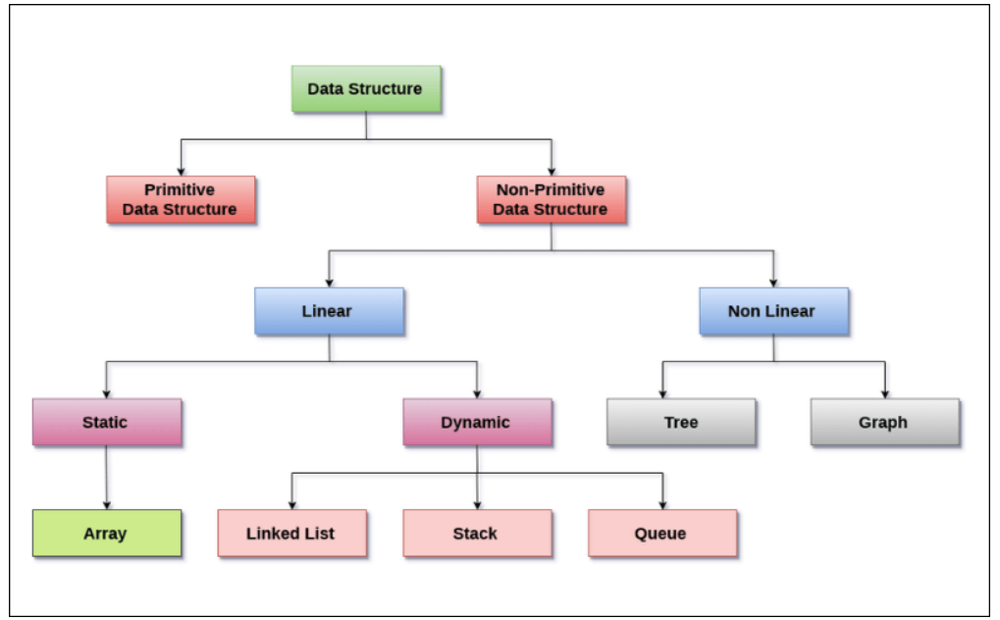
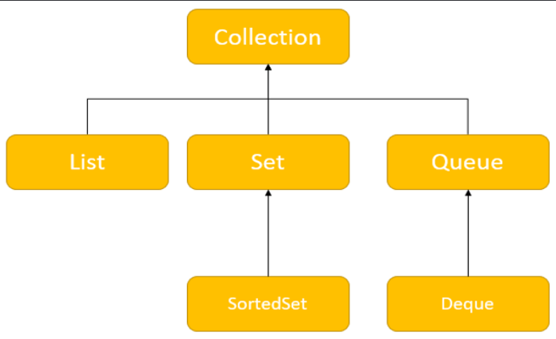
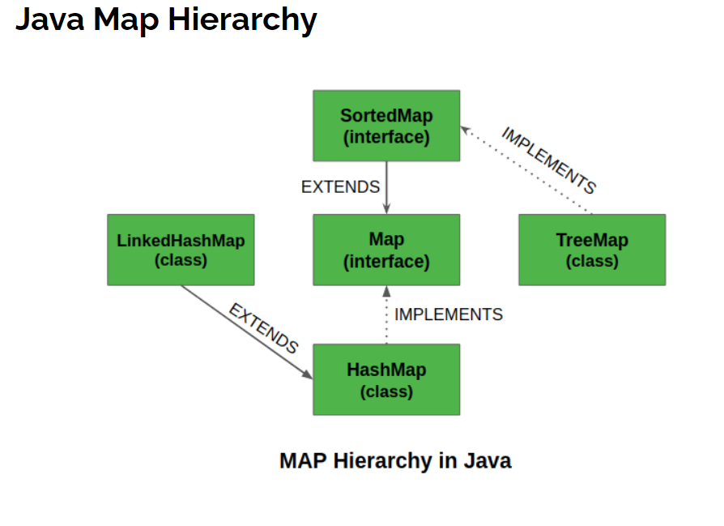
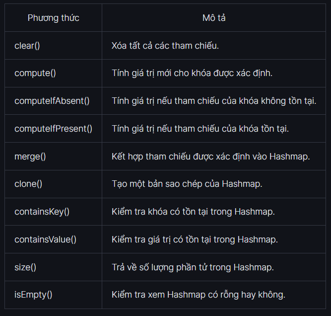
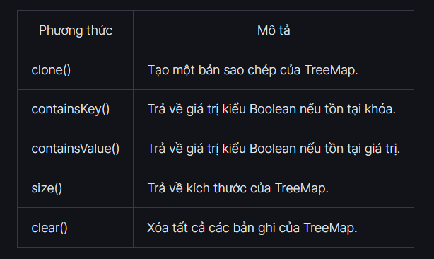

- [MỘT SỐ CẤU TRÚC DỮ LIỆU THƯỜNG THẤY TRONG JAVA](#một-số-cấu-trúc-dữ-liệu-thường-thấy-trong-java)
  - [Cấu trúc dữ liệu là gì, sử dụng khi nào?](#cấu-trúc-dữ-liệu-là-gì-sử-dụng-khi-nào)
    - [Cấu trúc dữ liệu là gì?](#cấu-trúc-dữ-liệu-là-gì)
    - [Các đặc tính của Data structure](#các-đặc-tính-của-data-structure)
    - [Data structure được sử dụng khi nào?](#data-structure-được-sử-dụng-khi-nào)
  - [Interface Iterable, Collection -\> List, Set, Queue.](#interface-iterable-collection---list-set-queue)
    - [Interface Iterable](#interface-iterable)
    - [Các phương thức của Iterator](#các-phương-thức-của-iterator)
    - [Collection -\> List, Set, Queue](#collection---list-set-queue)
    - [Các phương thức của Collection Interface](#các-phương-thức-của-collection-interface)
    - [List Interface](#list-interface)
      - [Các phương thức của List](#các-phương-thức-của-list)
    - [Set Interface](#set-interface)
      - [Các phương thức của Set](#các-phương-thức-của-set)
    - [Queue Interface](#queue-interface)
      - [Các phương thức của Queue](#các-phương-thức-của-queue)
  - [Interface Map, SortedMap -\> HashMap, TreeMap.](#interface-map-sortedmap---hashmap-treemap)
    - [Interface Map, SortedMap](#interface-map-sortedmap)
    - [Phương thức của Map](#phương-thức-của-map)
    - [HashMap](#hashmap)
      - [Các phương thức của HashMap](#các-phương-thức-của-hashmap)
    - [TreeMap](#treemap)
      - [Các phương thức của TreeMap](#các-phương-thức-của-treemap)
        - [Chèn các phần tử](#chèn-các-phần-tử)
        - [Truy cập vào các phần tử](#truy-cập-vào-các-phần-tử)
        - [Xóa các phần tử](#xóa-các-phần-tử)
        - [Thay thế các phần tử](#thay-thế-các-phần-tử)
      - [Comparator của TreeMap](#comparator-của-treemap)
  - [Sort trong Collection](#sort-trong-collection)
    - [Comparable](#comparable)
    - [Comparator](#comparator)
    - [Khác nhau giữa Comparable và Comparator](#khác-nhau-giữa-comparable-và-comparator)

# MỘT SỐ CẤU TRÚC DỮ LIỆU THƯỜNG THẤY TRONG JAVA
## Cấu trúc dữ liệu là gì, sử dụng khi nào?
### Cấu trúc dữ liệu là gì?
**Tham Khảo: [Cấu trúc dữ liệu là gì?](https://mikotech.vn/cau-truc-du-lieu-la-gi/)**
- Cấu trúc dữ liệu (**Data structure**) là cách sắp xếp và lưu trữ dữ liệu trong máy tính để có thể truy cập và xử lý một cách hiệu quả.
- Nó định nghĩa cách mà dữ liệu được tổ chức, quan hệ giữa các phần tử dữ liệu và các thao tác có thể thực hiện trên dữ liệu đó.
- **Cấu trúc dữ liệu** cung cấp các phương thức và thuật toán để thao tác, truy xuất, chèn, xóa và sắp xếp dữ liệu.
### Các đặc tính của Data structure
- **Data structure** được phân loại theo đặc tính của chúng:
  - **Tuyến tính hoặc phi tuyến tính:** Đặc tính này mô tả liệu các mục dữ liệu được sắp xếp theo thứ tự hay không.
    - **Tuyến tính:** các cấu trúc dữ liệu mà các phần tử dữ liệu được sắp xếp theo một thứ tự nhất định `(danh sách, mảng, hàng đợi, stack...)`
    - **Không tuyến tính:** các cấu trúc dữ liệu mà các phần tử dữ liệu được sắp xếp theo một thứ tự không nhất định `(cây, đồ thị..)`
  - **Đồng nhất hoặc không đồng nhất:** Đặc tính này mô tả liệu tất cả các mục dữ liệu trong một kho lưu trữ nhất định có cùng loại hay không.
  - **Tĩnh hoặc động:** Đặc tính này mô tả cách các cấu trúc dữ liệu được biên dịch. 
    - **Data structure tĩnh** có kích thước, cấu trúc và vị trí bộ nhớ cố định tại thời điểm biên dịch. 
    - **Data structure động** có kích thước, cấu trúc và vị trí bộ nhớ có thể thu nhỏ hoặc mở rộng, tùy thuộc vào việc sử dụng.



### Data structure được sử dụng khi nào?
- **Lưu trữ và truy xuất dữ liệu:** Cấu trúc dữ liệu như mảng, danh sách, hàng đợi và cây được sử dụng để lưu trữ và truy xuất dữ liệu một cách có tổ chức và hiệu quả. Chúng cho phép truy cập và thao tác dữ liệu một cách nhanh chóng và dễ dàng.
- **Tìm kiếm và sắp xếp:** Cấu trúc dữ liệu như cây nhị phân, hash map và đồ thị được sử dụng để thực hiện các phép tìm kiếm và sắp xếp dữ liệu. Chúng cung cấp các thuật toán tối ưu để tìm kiếm phần tử cụ thể hoặc sắp xếp dữ liệu theo một tiêu chí nhất định.
- **Quản lý dữ liệu:** Cấu trúc dữ liệu được sử dụng để quản lý và mô hình hóa các mối quan hệ và liên kết giữa các đối tượng hoặc dữ liệu. Chúng cho phép xác định các mối quan hệ phức tạp và thực hiện các phép toán liên quan đến dữ liệu liên quan.
- **Tối ưu hóa hiệu suất:** Sử dụng các cấu trúc dữ liệu phù hợp có thể cải thiện hiệu suất và thời gian chạy của chương trình. Lựa chọn đúng cấu trúc dữ liệu có thể giảm thiểu số lần truy cập đến dữ liệu, giảm bớt thời gian thực thi và tối ưu hóa tài nguyên máy tính.
- **Tạo các dạng dữ liệu phức tạp:** Cấu trúc dữ liệu cho phép tạo ra các dạng dữ liệu phức tạp hơn như hàng đợi ưu tiên, cấu trúc dữ liệu đa chiều, đồ thị định hướng, và nhiều hơn nữa. Chúng mở rộng khả năng biểu diễn và xử lý dữ liệu trong các ứng dụng phức tạp.

## Interface Iterable, Collection -> List, Set, Queue.
### Interface Iterable
- **Iterator Interface** của `Collections` trong Java cho phép chúng ta truy cập các phần tử của các tập hợp và được sử dụng để duyệt qua các phần tử trong tập hợp như `Map, List hoặc Set`.
- Nó giúp dễ dàng truy xuất các phần tử của một tập hợp và thực hiện các thao tác trên mỗi phần tử. Nó có một Interface con là `ListIterator.`
- Chúng ta chỉ có thể duyệt qua các phần tử theo hướng về phía trước bằng cách sử dụng `Interface` này. Ngoài ra, việc sử dụng `ListIterator Interface`, kế thừa `Iterator`, có thể duyệt phần tử theo cả hai hướng. Cả hai thao tác đọc và loại bỏ phần tử đều có thể được thực hiện bởi `Iterator Interface.`

- Tất cả các tập hợp trong Java bao gồm một phương thức `iterator()`. Phương thức này trả về một đối tượng của vòng lặp được sử dụng để lặp qua các phần tử của tập hợp.
### Các phương thức của Iterator
- Phương thức hasNext(): Trả về true nếu tồn tại một phần tử trong tập hợp.
- Phương thức next(): Trả về phần tử tiếp theo của tập hợp.
- Phương thức remove(): Loại bỏ phần tử cuối cùng được trả về bởi next().
- Phương thức forEachRemaining(): Thực hiện hành động được chỉ định cho từng phần tử còn lại của tập hợp.
>**Ví dụ:**
```Java
import java.util.ArrayList; 
import java.util.Iterator; 
class Main {     
        public static void main(String[] args) {
            ArrayList<Integer> so_nguyen = new ArrayList<>();         
            so_nguyen.add(34);         
            so_nguyen.add(25);         
            so_nguyen.add(58);         
            System.out.println(so_nguyen);         
            Iterator<Integer> phan_tu = so_nguyen.iterator();         
            int i = phan_tu.next();         
            System.out.println(i);         
            phan_tu.remove();         
            while(phan_tu.hasNext()) {
                phan_tu.forEachRemaining((gia_tri) -> System.out.print(gia_tri + " "));         
            }     
        } 
}

[34, 25, 58]
34
25 58
```
- `phan_tu.forEachRemaining((gia_tri) -> System.out.print(gia_tri + " "));` chúng ta đã truyền biểu thức lambda làm đối số của phương thức forEachRemaining(). Phương thức này sẽ in tất cả các phần tử còn lại của danh sách mảng.
### Collection -> List, Set, Queue
- **Collection Interface** là `Interface gốc của Collection Framework`. Sẽ không có sự triển khai trực tiếp vào Interface này. Tuy nhiên, nó được triển khai thông qua các `Interface con như List, Set hoặc Queue`.



**1. List Interface**
List Interface là một tập hợp có thứ tự cho phép chúng ta thêm và bớt các phần tử như một mảng.

**2. Set Interface**
Set Interface cho phép chúng ta lưu trữ các phần tử trong các tập hợp khác nhau tương tự như tập hợp trong toán học. Nó không thể có các phần tử trùng lặp.

**3. Queue Interface**
Queue Interface được sử dụng khi chúng ta muốn lưu trữ và truy cập các phần tử theo cách Vào trước, Ra sau (FIFO)

### Các phương thức của Collection Interface
- **Collection Interface** bao gồm nhiều phương thức khác nhau có thể được sử dụng để thực hiện các thao tác khác nhau trên các đối tượng. Các phương thức này có sẵn trong tất cả các Interface con của nó.
    - **Phương thức add()** được sử dụng để chèn phần tử được chỉ định.
    - **Phương thức size()** được sử dụng để trả về kích thước.
    - **Phương thức remove()** được sử dụng để xóa phần tử được chỉ định.
    - **Phương thức iterator()** được sử dụng để trả về một vòng lặp để truy cập các phần tử.
    - **Phương thức addAll()** được sử dụng để thêm tất cả các phần tử của một tập hợp cụ thể.
    - **Phương thức removeAll(**) được sử dụng để xóa tất cả các phần tử của tập hợp được chỉ định.
    - **Phương thức clear()** được sử dụng để xóa tất cả các phần tử.
### List Interface
- Vì List là một Interface, do đó, ta sẽ không thể tạo một đối tượng của List.
- Để sử dụng các phương thức của List Interface, chúng ta có thể sử dụng các lớp sau:
  - ArrayList (`List <String> a = new ArrayList <>();`)
  - LinkedList (`List <String> b = new LinkedList <>();`)
  - Vector (`List <String> b = new Vector <>();`)
  - Stack (`List <String> b = new Stack <>();`)

#### Các phương thức của List
- List Interface bao gồm tất cả các phương thức của Collection Interface. Bởi Collection là một Interface cha.
- Một số phương thức thường được sử dụng của Collection Interface cũng có sẵn trong List Interface bao gồm:
  - `Phương thức add()` được sử dụng để thêm một phần tử vào danh sách.
  - `Phương thức addAll()` được sử dụng để thêm tất cả các phần tử của danh sách này vào danh sách khác.
  - `Phương thức get()` được sử dụng để giúp truy cập ngẫu nhiên các phần tử từ danh sách.
  - `Phương thức iterator()` được sử dụng để trả về đối tượng vòng lặp có thể được sử dụng để truy cập tuần tự các phần tử của danh sách.
  - `Phương thức set()` được sử dụng để thay đổi các phần tử của danh sách.
  - `Phương thức remove()` được sử dụng để xóa một phần tử khỏi danh sách.
  - `Phương thức removeAll()` được sử dụng để xóa tất cả các phần tử khỏi danh sách.
  - `Phương thức clear()` được sử dụng để xóa tất cả các phần tử khỏi danh sách.
  - `Phương thức size()` được sử dụng để trả về độ dài của danh sách.
  - `Phương thức toArray()` được sử dụng để chuyển đổi một danh sách thành một mảng.
  - `Phương thức contain()` được sử dụng để trả về true nếu danh sách chứa phần tử được xác định.

### Set Interface
- Vì Set là một Interface nên chúng ta không thể tạo các đối tượng từ nó. Để sử dụng các chức năng của Set Interface, chúng ta có thể sử dụng các lớp sau:
  - HashSet (`Set<String> a = new HashSet<>();`)
  - LinkedHashSet (`Set<String> a = new LinkedHashSet<>();`)
  - EnumSet (`Set<String> a = new EnumSet<>();`)
  - TreeSet (`Set<String> a = new TreeSet<>();`)

#### Các phương thức của Set
- Set Interface bao gồm tất cả các phương thức của Collection Interface. Một số phương thức thường được sử dụng của Collection Interface cũng có sẵn trong Set Interface là:
  - `Phương thức add():` Thêm phần tử được chỉ định vào tập hợp.
  - `Phương thức addAll():` Thêm tất cả các phần tử của tập hợp được chỉ định vào tập hợp gọi phương thức này.
  - `Phương thức iterator():` Trả về một đối tượng vòng lặp có thể được sử dụng để truy cập tuần tự các phần tử của tập hợp.
  - `Phương thức remove():` Xóa phần tử được chỉ định khỏi tập hợp.
  - `Phương thức removeAll():` Xóa tất cả các phần tử khỏi tập hợp có trong một tập hợp khác được chỉ định.
  - `Phương thức retainAll():` Giữ lại tất cả các phần tử trong tập hợp cũng có mặt trong một tập hợp khác được chỉ định.
  - `Phương thức clear():` Xóa tất cả các phần tử khỏi tập hợp.
  - `Phương thức size():` Trả về độ dài (số phần tử) của tập hợp.
  - `Phương thức toArray():` Trả về một mảng chứa tất cả các phần tử của tập hợp.
  - `Phương thức contains():` Trả về giá trị true nếu tập hợp chứa phần tử được xác định.
  - `Phương thức containsAll():` Trả về giá trị true nếu tập hợp chứa tất cả các phần tử của tập hợp được xác định.
  - `Phương thức hashCode():` Trả về giá trị mã băm (địa chỉ của phần tử trong tập hợp).
### Queue Interface
- Vì Queue là một Interface, chúng ta không thể cung cấp việc triển khai trực tiếp cho nó. Để sử dụng các phương thức của Queue, chúng ta cần sử dụng các lớp triển khai bao gồm:
  - ArrayDeque  (`Queue<String> a = new LinkedList<>();`)
  - LinkedList (`Queue<String> b = new ArrayDeque<>();`)
  - PriorityQueue (`Queue<String> c = new PriorityQueue<>();`)

#### Các phương thức của Queue
- Queue Interface bao gồm tất cả các phương thức của Collection Interface. Đó là vì Collection là Interface cha của Queue.
- Một số phương thức thường được sử dụng của Queue Interface bao gồm:
  - `Phương thức add()`: Chèn phần tử được chỉ định vào Queue. Nếu thành công, add() trả về true, nếu không, nó sẽ đưa ra một ngoại lệ.
  - `Phương thức offer()`: Chèn phần tử được chỉ định vào Queue. Nếu thành công, offer() trả về true, nếu không, nó trả về false.
  - `Phương thức element()`: Trả về phần đầu của Queue. Đưa ra một ngoại lệ nếu Queue là rỗng.
  - `Phương thức peek()`: Trả về phần đầu của Queue. Trả về null nếu Queue trống rỗng.
  - `Phương thức remove()`: Trả về và xóa phần đầu của Queue. Đưa ra một ngoại lệ nếu Queue trống rỗng.
  - `Phương thức poll()`: Trả về và xóa phần đầu của Queue. Trả về null nếu Queue trống.

## Interface Map, SortedMap -> HashMap, TreeMap.
### Interface Map, SortedMap 
- `Map interface` trong Java cung cấp các chức năng của một map-data-structure, được dùng để lưu một cặp giá trị key/value. Key là một giá trị duy nhất tương ứng với một value.



- Chúng ta có 2 interface Map và SortedMap để triển khai các chức năng của Map, và 3 implement `HashMap, LinkedHashMap, TreeMap` triển khai từ các interface trên.

### Phương thức của Map
- Bên cạnh các phương thức có sẵn trong Collections Interface, Map Interface bao gồm các phương thức sau:
  - `Phương thức put(K, V)`: Chèn tập hợp của khóa K và giá trị V vào Map. Nếu khóa đã có, giá trị mới sẽ thay thế cho giá trị cũ.
  - `Phương thức putAll()`: Chèn tất cả các mục từ Map được xác định vào Map gọi tới phương thức này.
  - `Phương thức putIfAbsent(K, V)`: Chèn liên kết nếu khóa K chưa được liên kết với giá trị V.
  - `Phương thức get(K)`: Trả về giá trị được liên kết với khóa K. Nếu không tìm thấy khóa, nó sẽ trả về null.
  - `Phương thức getOrDefault(K, giá trị mặc định)`: Trả về giá trị được liên kết với khóa K. Nếu không tìm thấy khóa, nó sẽ trả về giá trị mặc định.
  - `Phương thức containsKey(K)`: Kiểm tra xem khóa K có trong Map hay không.
  - `Phương thức containsValue(V)`: Kiểm tra xem giá trị được chỉ định V có trong Map hay không.
  - `Phương thức Replace(K, V)`: Thay giá trị của khóa K bằng giá trị mới được xác định V.
  - `phương thức Replace(K, giá trị cũ, giá trị mới)`: Thay thế giá trị của khóa K bằng giá trị mới newValue nếu khóa K được liên kết với giá trị oldValue.
  - `Phương thức remove(K)`: Xóa mục khỏi Map được thể hiện bằng khóa K.
  - `Phương thức remove(K, V)`: Xóa mục khỏi Map có khóa K được liên kết với giá trị V.
  - `Phương thức keySet()`: Trả về một tập hợp tất cả các khóa có trong Map.
  - `Phương thức values()`: Trả về một tập hợp tất cả các giá trị có trong Map.
  - `Phương thức entrySet()`: Trả về một tập hợp tất cả ánh xạ khóa / giá trị có trong một Map.

### HashMap
- Map cung cấp chức năng của cấu trúc dữ liệu bảng băm. Nó lưu trữ các phần tử trong các cặp khóa và giá trị. Ở đây, các khóa là định danh duy nhất được sử dụng để liên kết từng giá trị trên Map. Lớp HashMap thực hiện triển khai cho Map Interface.
- Tạo HashMap: `HashMap <K, V> map = new HashMap<>();`

#### Các phương thức của HashMap
- Lớp HashMap cung cấp nhiều phương thức khác nhau để thực hiện các thao tác khác nhau trên Hashmap. Chúng ta sẽ xem xét một số thao tác thường được sử dụng:
  - Thêm các phần tử: `Phương thức put(K, V)`
  - Truy cập các phần tử: `Phương thức get(K)`
  - Thay đổi các phần tử: `Phương thức replace(K, V)`
  - Loại bỏ các phần tử: `Phương thức remove(K, V)`
- Một số phương thức khác của HashMap



### TreeMap
**Tham Khảo: [TreeMap](https://tek4.vn/tutorial/java-tutorial/treemap)**
>TreeMap<Khóa, Giá trị> a = new TreeMap<>();
- Chúng ta đã tạo một `TreeMap` có tên là a mà không có bất kỳ đối số nào. Trong trường hợp này, các phần tử trong `TreeMap` được sắp xếp một cách tự nhiên (thứ tự tăng dần). Tuy nhiên, chúng ta có thể tùy chỉnh việc sắp xếp các phần tử bằng cách sử dụng `Comparator Interface`.

#### Các phương thức của TreeMap

##### Chèn các phần tử
- `Phương thức put()`: Chèn ánh xạ khóa và giá trị được chỉ định (bản ghi) vào Map.
- `Phương thức putAll()`: Chèn tất cả các mục từ Map được chỉ định vào Map gọi phương thức này.
- `Phương thức putIfAbsent()`: Chèn ánh xạ khóa và giá trị được chỉ định vào Map nếu khóa được chỉ định không có trong Map.

```Java
import java.util.TreeMap; 
class Main {     
        public static void main(String[] args) {         
        TreeMap<String, Integer> sinh_vien = new TreeMap<>();         
        sinh_vien.put("Nguyen A", 23);         
        sinh_vien.put("Nguyen B", 22);         
        sinh_vien.putIfAbsent("Nguyen C", 27);         
        System.out.println(sinh_vien);       //{Nguyen A=23, Nguyen B=22, Nguyen C=27}  
        TreeMap<String, Integer> sinh_vien2 = new TreeMap<>();         
        sinh_vien2.put("Nguyen D", 30);         
        sinh_vien2.putAll(sinh_vien);         
        System.out.println(sinh_vien2);     //{Nguyen A=23, Nguyen B=22, Nguyen C=27, Nguyen D=30}
        } 
}
```
##### Truy cập vào các phần tử
- Ta có thể sử dụng phương thức entrySet(), keySet() và values() để truy cập vào phần tử.
  - `Phương thức entrySet()`: Trả về một tập hợp tất cả các khóa và giá trị ánh xạ (bản ghi) của một TreeMap.
  - `Phương thức keySet()`: Trả về một tập hợp tất cả các khóa của TreeMap.
  - `Phương thức values()`: Trả về một tập hợp tất cả các ánh xạ của TreeMap.
```Java
import java.util.TreeMap;

class Main {
    public static void main(String[] args) {
        TreeMap<String, Integer> sinh_vien = new TreeMap<>();
        sinh_vien.put("Nguyen A", 23);
        sinh_vien.put("Nguyen B", 22);
        sinh_vien.putIfAbsent("Nguyen C", 27);
        System.out.println(sinh_vien.entrySet()); //[Nguyen A=23, Nguyen B=22, Nguyen C=27]
        System.out.println(sinh_vien.keySet()); //[Nguyen A, Nguyen B, Nguyen C]
        System.out.println(sinh_vien.values()); //[23, 22, 27]
    }
}
```
- Ta cũng có thể sử dụng phương thức `get()` và `getOrDefault()` để truy cập các phần tử.
  - `Phương thức get()`: Trả về giá trị được liên kết với khóa được chỉ định. Trả về null nếu không tìm thấy khóa.
  - `Phương thức getOrDefault()`: Trả về giá trị được liên kết với khóa được chỉ định. Trả về giá trị mặc định đã chỉ định nếu không tìm thấy khóa.
```Java
import java.util.TreeMap;

class Main {
    public static void main(String[] args) {
        TreeMap<String, Integer> sinh_vien = new TreeMap<>();
        sinh_vien.put("Nguyen A", 23);
        sinh_vien.put("Nguyen B", 22);
        sinh_vien.putIfAbsent("Nguyen C", 27);
        int i = sinh_vien.get("Nguyen A");
        System.out.println("ID sinh vien la: " + i); //23
        int j = sinh_vien.getOrDefault("Nguyen E", 34);
        System.out.println("ID sinh vien mac dinh la: " + j);//34
    }
}
```
##### Xóa các phần tử
- `Phương thức remove(khóa)`: Trả về và xóa bản ghi được liên kết với khóa được chỉ định khỏi TreeMap.
- `Phương thức remove(khóa, giá trị)`: Chỉ xóa bản ghi khỏi Map nếu khóa được chỉ định liên kết với giá trị được chỉ định và trả về giá trị kiểu boolean.
```Java
import java.util.TreeMap;

class Main {
    public static void main(String[] args) {
        TreeMap<String, Integer> sinh_vien = new TreeMap<>();
        sinh_vien.put("Nguyen A", 23);
        sinh_vien.put("Nguyen B", 22);
        sinh_vien.putIfAbsent("Nguyen C", 27);
        int i = sinh_vien.remove("Nguyen A");
        System.out.println("ID bi xoa la: " + i); // 23
        boolean kq = sinh_vien.remove("Nguyen C", 5);
        System.out.println("ID bi xoa khong?: " + kq);// false
    }
}
```
##### Thay thế các phần tử
- `Phương thức replace(khóa, giá trị):` Thay thế giá trị được ánh xạ bởi khóa được chỉ định bằng giá trị mới.
- `Phương thức replace(khóa, giá trị cũ, giá trị mới):` Chỉ thay thế giá trị cũ bằng giá trị mới nếu giá trị cũ đã được liên kết với khóa được chỉ định.
- `Phương thức ReplaceAll(hàm):` Thay thế từng giá trị của Map bằng kết quả của hàm được chỉ định.
```Java
import java.util.TreeMap;

class Main {
    public static void main(String[] args) {
        TreeMap<String, Integer> sinh_vien = new TreeMap<>();
        sinh_vien.put("Nguyen A", 23);
        sinh_vien.put("Nguyen B", 22);
        sinh_vien.putIfAbsent("Nguyen C", 27);
        sinh_vien.replace("Nguyen A", 13);
        sinh_vien.replace("Nguyen B", 22, 12);
        System.out.println(sinh_vien); // {Nguyen A=13, Nguyen B=12, Nguyen C=27}
        sinh_vien.replaceAll((key, oldValue) -> oldValue + 1);
        System.out.println(sinh_vien); // {Nguyen A=14, Nguyen B=13, Nguyen C=28}
    }
}
```
>**sinh_vien.replaceAll((key, oldValue) -> oldValue + 1);** chúng ta đã chuyển một biểu thức lambda hay Lambda expression làm đối số. Phương thức ReplaceAll() truy cập vào tất cả các bản ghi của Map. Sau đó, nó thay thế tất cả các phần tử bằng các giá trị mới.

**Note:** Ngoài ra còn có các phương thức điều hướng
- Các phương thức khác



#### Comparator của TreeMap
- Trong tất cả các ví dụ trên, các phần tử của TreeMap được sắp xếp tự nhiên (theo thứ tự tăng dần). Tuy nhiên, chúng ta cũng có thể tùy chỉnh thứ tự các khóa.
```Java
import java.util.TreeMap;
import java.util.Comparator;

class Main {
    public static void main(String[] args) {
        TreeMap<String, Integer> sinh_vien = new TreeMap<>(new CustomComparator());
        sinh_vien.put("Nguyen A", 23);
        sinh_vien.put("Nguyen B", 22);
        sinh_vien.putIfAbsent("Nguyen C", 27);
        System.out.println(sinh_vien);
    }
    public static class CustomComparator implements Comparator<String> {
        @Override
        public int compare(String a, String b) {
            int i = a.compareTo(b);
            if (i > 0) {
                return -1;
            }
            else if (i < 0) {
                return 1;
            }
            else {
                return 0;
            }
        }
    }
}

Output
{Nguyen C=27, Nguyen B=22, Nguyen A=23}
```
- Trong ví dụ trên, chúng ta đã tạo một TreeMap truyền vào lớp `CustomComparator` làm đối số. Lớp `CustomComparator` triển khai `Comparator Interface`. Sau đó, chúng ta ghi đè phương thức comapre() để sắp xếp các phần tử theo thứ tự ngược lại.
## Sort trong Collection
**Tham Khảo: [Comparable - Comparator](https://codegym.vn/blog/comparable-comparator-trong-java/)**
### Comparable
- `Interface Comparable` trong Java được sử dụng để sắp xếp các đối tượng của lớp do người dùng định nghĩa (user-defined).
- Để sử dụng được `Comparable`, ta phải `implements interface Comparable` cho lớp đối tượng cần được so sánh. Trong `interface Comparable`, ta được cung cấp một phương thức được sử dụng để so sánh: `public int compareTo (Object obj)`

- `Phương thức compareTo()` được sử dụng để so sánh đối tượng hiện tại với đối tượng được chỉ định. 
- Với interface `Comparable và phương thức compareTo()`, chúng ta có thể sắp xếp các phần tử của:
  - Các đối tượng String
  - Các đối tượng của lớp Wrapper
  - Các đối tượng của lớp do người dùng định nghĩa (User-defined)
- Khi ta `implement Comparable` cho một class, bắt buộc ta phải `override` lại phương thức `compareTo(Object obj)` cho class đó. Khi gọi phương thức `sort(List)` từ Collections, Collections sẽ lần lượt gọi phương thức `compareTo()` của từng phần tử để so sánh phần tử này với phần tử khác và dựa vào giá trị trả về của `compareTo()` mà sắp xếp chúng.
- `Phương thức compareTo()` có kiểu trả về là int và có quy ước:
  - Giá trị trả về < 0: phần tử hiện tại < phần tử khác
  - Giá trị trả về = 0: phần tử hiện tại = phần tử khác
  - Giá trị trà về > 0: phần tử hiện tại > phần tử khác

>**Ví Dụ:** Tạo một lớp sinh viên có tên Student inplement từ interface Comparable:
```Java
import java.util.ArrayList;
import java.util.Collections;
import java.util.List;

public class Student implements Comparable<Student> {
   private int id;
    private String name;
    private int age;
    private double gpa;
    public Student(){

    }
    public Student(int id, String name, int age, double gpa){
        super();
        this.id = id;
        this.name = name;
        this.age = age;
        this.gpa = gpa;
    }
    @Override
    public String toString(){
        return "Student [id=" + id + ", name=" + name + ", age=" + age + ", gpa=" + gpa + "]";
    }
    @Override
    public int compareTo(Student o) {
       return this.getAge() - o.getAge();
    }
    public int getId() {
        return id;
    }

    public void setId(int id) {
        this.id = id;
    }

    public String getName() {
        return name;
    }

    public void setName(String name) {
        this.name = name;
    }

    public int getAge() {
        return age;
    }

    public void setAge(int age) {
        this.age = age;
    }

    public double getGpa() {
        return gpa;
    }

    public void setGpa(double gpa) {
        this.gpa = gpa;
    }

    public static void main(String[] args) {
        List<Student> studentList = new ArrayList<>();
        studentList.add(new Student(1, "Nguyen Van A", 25, 8.0));
        studentList.add(new Student(2, "Nguyen Van B", 21, 7.0));
        studentList.add(new Student(3, "Nguyen Van C", 22, 9.0));
        studentList.add(new Student(4, "Nguyen Van D", 27, 6.0));
        studentList.add(new Student(5, "Nguyen Van E", 20, 5.0));
        studentList.add(new Student(6, "Nguyen Van F", 19, 4.0));
        Collections.sort(studentList);
        for (Student student : studentList) {
            System.out.println(student.toString());
        }
    }
}

Student [id=6, name=Nguyen Van F, age=19, gpa=4.0]
Student [id=5, name=Nguyen Van E, age=20, gpa=5.0]
Student [id=2, name=Nguyen Van B, age=21, gpa=7.0]
Student [id=3, name=Nguyen Van C, age=22, gpa=9.0]
Student [id=1, name=Nguyen Van A, age=25, gpa=8.0]
Student [id=4, name=Nguyen Van D, age=27, gpa=6.0]
```

### Comparator
- `Comparator` trong Java được sử dụng để sắp xếp các đối tượng của lớp do người dùng định nghĩa (user-defined)
- Để sử dụng `Comparator` ta không cần phải `implements Comparator` cho lớp đối tượng cần được so sánh. 
- Chứa hai phương thức là `compare(Object obj1, Object obj2)` và `equals(Object element)`
- `public int compare (Object obj1, Object obj2)`: Phương thức `compare()` được sử dụng để so sánh giữa hai đối tượng obj1 và obj2, cũng có kiểu trả về int, và quy ước giống như `compareTo()` của `Comparable`.
- Với interface Comparator và phương thức `compare()`, chúng ta có thể sắp xếp các phần tử của:
  - Các đối tượng String
  - Các đối tượng của lớp Wrapper
  - Các đối tượng của lớp do người dùng định nghĩa (User-defined)
- Interface này không đi với phương thức `sort(List list)`, mà là: `static void sort(List, Comparator)`
- Ở phương thức này, Collections không yêu cầu các phần tử trong list phải `implement Comparator` mà thay vào đó, phải truyền thêm vào một biến tham chiếu kiểu Object có `implement Comparator`.
- Khi `implement Comparator` thì ta phải override lại phương thức `compare(Object obj1, Object obj2)` để làm rõ tiêu chí sắp xếp.

>**Ví dụ:** Giống như ví dụ trên
```Java
import java.util.ArrayList;
import java.util.Collections;
import java.util.Comparator;
import java.util.List;

public class Student{
   private int id;
    private String name;
    private int age;
    private double gpa;
    public Student(){

    }
    public Student(int id, String name, int age, double gpa){
        super();
        this.id = id;
        this.name = name;
        this.age = age;
        this.gpa = gpa;
    }
    @Override
    public String toString(){
        return "Student [id=" + id + ", name=" + name + ", age=" + age + ", gpa=" + gpa + "]";
    }

    public int getId() {
        return id;
    }

    public void setId(int id) {
        this.id = id;
    }

    public String getName() {
        return name;
    }

    public void setName(String name) {
        this.name = name;
    }

    public int getAge() {
        return age;
    }

    public void setAge(int age) {
        this.age = age;
    }

    public double getGpa() {
        return gpa;
    }

    public void setGpa(double gpa) {
        this.gpa = gpa;
    }

    public static void main(String[] args) {
        List<Student> studentList = new ArrayList<>();
        studentList.add(new Student(1, "Nguyen Van A", 25, 8.0));
        studentList.add(new Student(2, "Nguyen Van B", 21, 7.0));
        studentList.add(new Student(3, "Nguyen Van C", 22, 9.0));
        studentList.add(new Student(4, "Nguyen Van D", 27, 6.0));
        studentList.add(new Student(5, "Nguyen Van E", 20, 5.0));
        studentList.add(new Student(6, "Nguyen Van F", 19, 4.0));

        Collections.sort(studentList, new Comparator<Student>() {
            @Override
            public int compare(Student o1, Student o2) {
                return o1.getAge() - o2.getAge(); // sort by age
            }
        });

        for (Student student : studentList) {
            System.out.println(student.toString());
        }
    }
}

Student [id=6, name=Nguyen Van F, age=19, gpa=4.0]
Student [id=5, name=Nguyen Van E, age=20, gpa=5.0]
Student [id=2, name=Nguyen Van B, age=21, gpa=7.0]
Student [id=3, name=Nguyen Van C, age=22, gpa=9.0]
Student [id=1, name=Nguyen Van A, age=25, gpa=8.0]
Student [id=4, name=Nguyen Van D, age=27, gpa=6.0]
```
### Khác nhau giữa Comparable và Comparator

| Comparable                                                                             | Comparator                                                                                         |
| -------------------------------------------------------------------------------------- | -------------------------------------------------------------------------------------------------- |
| Phải implements giao tiếp Comparable cho lớp đối tượng cần được so sánh.               | Không phải implements giao tiếp Comparator cho lớp đối tượng cần được so sánh.                     |
| Comparable cung cấp phương thức compareTo() để sắp xếp các phần tử.                    | Comparator cung cấp phương thức compare() để sắp xếp các phần tử.                                  |
| Có thể sắp xếp các phần tử của kiểu Comparable bởi phương thức Collections.sort(List). | Có thể sắp xếp các phần tử của kiểu Comparator bởi phương thức Collections.sort(List, Comparator). |