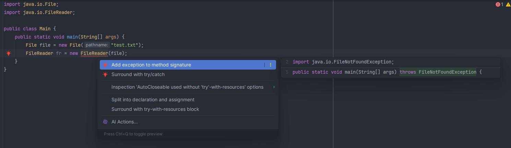
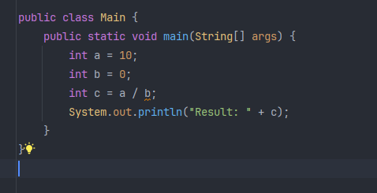
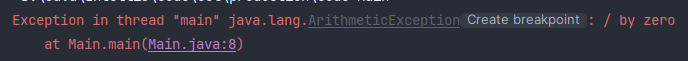
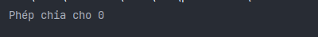
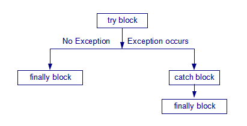
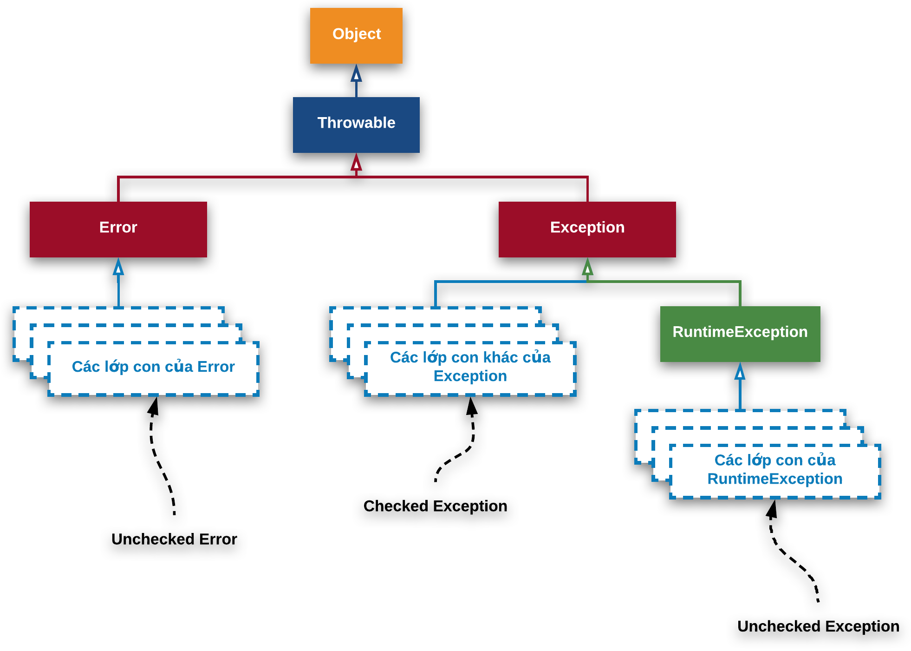

- [LUÔN CÓ NGOẠI LỆ, XỬ LÍ NGOẠI LỆ](#luôn-có-ngoại-lệ-xử-lí-ngoại-lệ)
  - [Làm quen với Exception: Checked và Unchecked Exception, Error](#làm-quen-với-exception-checked-và-unchecked-exception-error)
    - [Checked Exception](#checked-exception)
    - [Unchecked Exception](#unchecked-exception)
    - [Error](#error)
  - [Bắt Exception với try-catch](#bắt-exception-với-try-catch)
    - [Try Với Nhiều Catch](#try-với-nhiều-catch)
    - [Catch Với Lớp Exception Luôn Được Không?](#catch-với-lớp-exception-luôn-được-không)
  - [Sử dụng finally](#sử-dụng-finally)
    - [Ví dụ finally trong Java](#ví-dụ-finally-trong-java)
  - [Cây phân cấp Exception, phân biệt throw và throws](#cây-phân-cấp-exception-phân-biệt-throw-và-throws)
    - [Cây phân cấp Exception](#cây-phân-cấp-exception)
    - [Từ khóa throw trong java](#từ-khóa-throw-trong-java)
    - [Từ khóa throws](#từ-khóa-throws)
    - [Khác nhau giữa throw và throws](#khác-nhau-giữa-throw-và-throws)
  - [Tạo ra Exception của riêng mình](#tạo-ra-exception-của-riêng-mình)
    - [Tại sao cần sử dụng Custom Exception?](#tại-sao-cần-sử-dụng-custom-exception)
    - [Custom Exception](#custom-exception)
    - [Sử dụng Custom Exception](#sử-dụng-custom-exception)

# LUÔN CÓ NGOẠI LỆ, XỬ LÍ NGOẠI LỆ
## Làm quen với Exception: Checked và Unchecked Exception, Error
- **Exception** là một sự kiện xảy ra trong quá trình thực thi một chương trình Java, nó làm phá vỡ cái flow (luồng xử lý) bình thường của một chương trình, thậm chí chết chương trình.
- Một ngoại lệ có thể xảy ra với nhiều lý do khác nhau, nó nằm ngoài dự tính của chương trình. Một vài ngoại lệ xảy ra bởi lỗi của người dùng, một số khác bởi lỗi của lập trình viên và số khác nữa đến từ lỗi của nguồn dữ liệu vật lý. Chẳng hạn như:
  - Người dùng nhập dữ liệu không hợp lệ.
  - Truy cập ngoài chỉ số mảng.
  - Một file cần được mở nhưng không thể tìm thấy.
  - Kết nối mạng bị ngắt trong quá trình thực hiện giao tiếp hoặc JVM hết bộ nhớ.
  - …
- Ví dụ: Chương trình chia 2 số. Số chia bằng = 0 thì phát sinh ra lỗi và đó được coi là một ngoại lệ.

```Java
public class ExceptionExample1 {
 
    public static void main(String[] args) {
 
        int zero = 0;
 
        int average = 10 / zero;
 
        System.out.println("Average = " + average);
 
    }
}
```
### Checked Exception
- **Checked exception**, việc kiểm tra được thực hiện ngay thời điểm compile time, một số IDE sẽ giúp chúng ta bằng cách hiển thị lỗi cú pháp nếu ta gọi một method throw ra bất kỳ checked exception nào mà không được catch. Một số checked exception tiêu biểu như: `IOException, InterruptedException, XMLParseException.. `

- Ví dụ: Thao tác trên file



### Unchecked Exception
- **Unchecked exception**, việc xác định có exception xảy ra hay không chỉ có thể thực hiện ở thời điểm runtime, và các IDE sẽ không giúp chúng ta xác định được chuyện đó. Một số unchecked exception tiêu biểu là: `NullPointerException, IndexOutOfBoundsException, ClassCastException…`

- Ví dụ: Thực hiện phép chia cho 0



- Sau khi chạy chương trình thì sẽ báo ra một ngoại lệ như hình



### Error
- Error là một dạng ngoại lệ mà chúng ta không thể xử lý được. Error thường xảy ra khi mà hệ thống gặp phải những vấn đề nghiêm trọng, không thể khắc phục được.

## Bắt Exception với try-catch
- Để bắt Exception, ta sử dụng cấu trúc try-catch. Cấu trúc try-catch sẽ giúp chúng ta bắt ngoại lệ, và xử lý nó một cách an toàn.
- Cấu trúc try-catch

```java

try {
    // Thực thi các câu lệnh có thể ném ra ngoại lệ
} catch (Exception e) {
    // Xử lý ngoại lệ
}

```

- Trong đó:

    - `try`: Là một khối lệnh, chứa các câu lệnh có thể ném ra ngoại lệ.
    - `catch`: Là một khối lệnh, chứa các câu lệnh xử lý ngoại lệ. Trong đó, `Exception e` là một biến, chứa thông tin về ngoại lệ xảy ra.

- Ví dụ: Quay trở lại phép chia cho 0

```Java

public class Main {
    public static void main(String[] args) {
        int a = 10;
        int b = 0;
        try {
            int c = a / b;
            System.out.println(c);
        } catch (Exception e){
            System.out.println("Phép chia cho 0");
        }
    }
}
```
- Kết quả sau khi chạy chương trình: 

-  đã xử lý được ngoại lệ 

### Try Với Nhiều Catch

```Java
public class Main {
    public static void main(String[] args) {
        Scanner sc = new Scanner(System.in);
        try{
            int a = Integer.parseInt(sc.nextLine());
            int b = Integer.parseInt(sc.nextLine());
            System.out.println(a/b);
        } catch (ArithmeticException e){
            System.out.println("Phép chia cho 0");
        } catch (NumberFormatException e){
            System.out.println("Chuỗi nhập vào không phải là số");
        }
    }
}
```
- Ví dụ trên ta đã có thể catch nhiều Exception trong cùng một cấu trúc try-catch.

### Catch Với Lớp Exception Luôn Được Không?

- Bạn không nhất thiết phải catch với cụ thể các lớp con như `ArrayIndexOutOfBoundsException` hay `ArithmeticException` như các ví dụ trên kia. Mà bạn có thể sử dụng lớp cha `Exception` luôn. Khi đó câu lệnh sẽ là `try {…} catch (Exception e) {…}`. Vì đâu phải lúc nào bạn cũng nhớ các lớp con của Exception đâu!

## Sử dụng finally
- Khối `finally` là tuỳ chọn, không bắt buộc phải có. Khối này được đặt sau khối catch cuối cùng. Chương trình sẽ thực thi câu lệnh đầu tiên của khối `finally` ngay sau khi gặp câu lệnh `return` hay lệnh `break` trong khối try.

- Khối `finally` bảo đảm lúc nào cũng được thực thi, bất chấp có ngoại lệ xảy ra hay không. Hình minh họa sự thực hiện của các khối try, catch và finally



### Ví dụ finally trong Java

- Ví dụ sử dụng khối lệnh finally nơi ngoại lệ không xảy ra.

```Java
public class Main {
    public static void main(String[] args) {
        try {
            int data = 25 / 5;
            System.out.println(data);
        } catch (NullPointerException e) {
            System.out.println(e);
        } finally {
            System.out.println("finally block is always executed");
        }
        System.out.println("rest of the code...");
    }
}

5
finally block is always executed
rest of the code...
```
- Ví dụ sử dụng khối lệnh finally nơi ngoại lệ xảy ra nhưng không xử lý.

```Java
public class Main {
    public static void main(String args[]) {
        try {
            int data = 25 / 0;
            System.out.println(data);
        } catch (NullPointerException e) {
            System.out.println(e);
        } finally {
            System.out.println("finally block is always executed");
        }
        System.out.println("rest of the code...");
    }
}

finally block is always executed
Exception in thread "main" java.lang.ArithmeticException: / by zero
```

- Ví dụ sử dụng khối lệnh finally nơi ngoại lệ xảy ra và được xử lý.
```Java
public class Main {
    public static void main(String args[]) {
        try {
            int data = 25 / 0;
            System.out.println(data);
        } catch (ArithmeticException e) {
            System.out.println(e);
        } finally {
            System.out.println("finally block is always executed");
        }
        System.out.println("rest of the code...");
    }
}

java.lang.ArithmeticException: / by zero
finally block is always executed
rest of the code...
```

- Ví dụ sử dụng khối lệnh finally trong trường hợp trong khối try có lệnh return.

```Java
public class Main {
    public static void main(String args[]) {
        try {
            int data = 25;
            if (data % 2 != 0) {
                System.out.println(data + " is odd number");
                return;
            }
        } catch (ArithmeticException e) {
            System.out.println(e);
        } finally {
            System.out.println("finally block is always executed");
        }
        System.out.println("rest of the code...");
    }
}

25 is odd number
finally block is always executed
```
## Cây phân cấp Exception, phân biệt throw và throws

### Cây phân cấp Exception
- Trong Java, Exception được phân cấp theo một cấu trúc cây, với `Throwable` là gốc của cây, `Error` và `Exception` là 2 nhánh con của `Throwable`.



### Từ khóa throw trong java
- Từ khoá `throw` trong java được sử dụng để ném ra một ngoại lệ `(exception)` cụ thể.
- Chúng ta có thể ném một trong hai ngoại lệ `checked` hoặc `unchecked` trong java bằng từ khóa `throw`. Từ khóa `throw` chủ yếu được sử dụng để ném `ngoại lệ tùy chỉnh (ngoại lệ do người dùng tự định nghĩa).`

```Java
public class Main {
    public static void main(String args[]) {
        Scanner sc = new Scanner(System.in);
        try {
            int age = sc.nextInt();
            System.out.println("Tuổi của ban là: " + age);
            if (age < 18) {
                throw new Exception("Em chưa 18 =))");
            }
        } catch (Exception e) {
            System.out.println("Lỗi: " + e);
        }
    }
}
```
### Từ khóa throws
- Từ khóa `throws` trong java được sử dụng để khai báo một ngoại lệ
- Cú pháp:
```Java
return_type method_name() throws exception_class_name {
// method code
}
```
- Ngoại lệ nào nên được khai báo: **Chỉ ngoại lệ checked**, bởi vì:
  - Ngoại lệ `unchecked`: nằm trong sự kiểm soát của bạn.
  - `error`: nằm ngoài sự kiểm soát của bạn, ví dụ bạn sẽ không thể làm được bất kì điều gì khi các lỗi `VirtualMachineErro`r hoặc `StackOverflowError` xảy ra.

### Khác nhau giữa throw và throws

| throw                                                                                                                                                              | throws                                                                                                                                                                                 |
| ------------------------------------------------------------------------------------------------------------------------------------------------------------------ | -------------------------------------------------------------------------------------------------------------------------------------------------------------------------------------- |
| Từ khóa throw trong java được sử dụng để ném ra một ngoại lệ rõ ràng.                                                                                              | Từ khóa throws trong java được sử dụng để khai báo một ngoại lệ.                                                                                                                       |
| Ngoại lệ checked không được truyền ra nếu chỉ sử dụng từ khóa throw.                                                                                               | Ngoại lệ checked được truyền ra ngay cả khi chỉ sử dụng từ khóa throws.                                                                                                                |
| Sau throw là một instance.                                                                                                                                         | Sau throws là một hoặc nhiều class.                                                                                                                                                    |
| Throw được sử dụng trong phương thức có thể quăng ra Exception ở bất kỳ dòng nào trong phương thức (sau đó dùng try-catch để bắt hoặc throws cho thằng khác sử lý) | Throws được khai báo ngay sau dấu đóng ngoặc đơn của phương thức. Khi một phương thức có throw bên trong mà không bắt lại (try – catch) thì phải ném đi (throws) cho thằng khác xử lý. |
| Không thể throw nhiều exceptions.                                                                                                                                  | Có thể khai báo nhiều exceptions, Ví dụ: public void method() throws IOException, SQLException { }                                                                                     |

## Tạo ra Exception của riêng mình
### Tại sao cần sử dụng Custom Exception?
- Khi bạn phát triển một ứng dụng Java phức tạp, có thể bạn muốn xử lý các tình huống đặc biệt mà các lớp ngoại lệ có sẵn trong Java không đáp ứng. Trong trường hợp này, việc tạo một ngoại lệ tùy chỉnh sẽ giúp bạn:
  - Định rõ tình huống đặc biệt mà bạn muốn xử lý.
  - Cung cấp thông điệp ngoại lệ riêng để ghi log hoặc hiển thị cho người dùng cuối.
  - Tùy chỉnh cách xử lý ngoại lệ để phù hợp với logic ứng dụng của bạn.

### Custom Exception
- Để tạo một Custom Exception trong Java, bạn cần tạo một lớp kế thừa từ lớp `Exception` hoặc các lớp con của nó. Dưới đây là một ví dụ về cách tạo một Custom Exception có tên là `InvalidAgeException`:

```Java
class InvalidAgeException extends Exception {
        public InvalidAgeException(String message) {
            super(message);
        }
    }
```
### Sử dụng Custom Exception

```Java
public class Main {
    static class InvalidAgeException extends Exception {
        public InvalidAgeException(String message) {
            super(message);
        }
    }

    public static void main(String[] args) {
        try {
            input();
        } catch (InvalidAgeException e) {
            System.out.println(e.getMessage());
        }
    }
    
    public static void input() throws InvalidAgeException {
        Scanner scanner = new Scanner(System.in);
        System.out.print("Enter your age: ");
        int age = scanner.nextInt();
        if (age < 18) {
            throw new InvalidAgeException("Bạn chưa đủ 18 tuổi!");
        }
        System.out.println("Your age is " + age);
    }
}
```